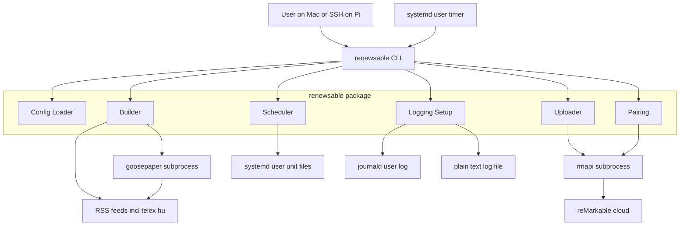
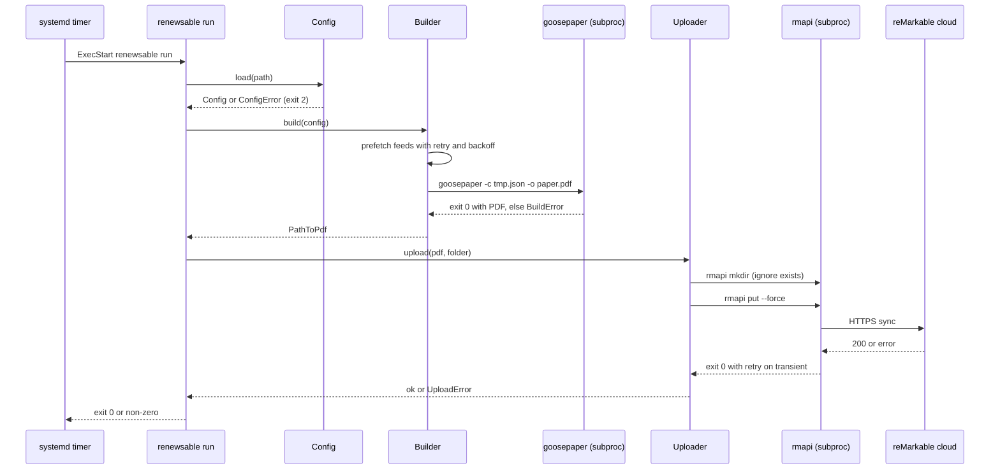

# Design Document — daily-paper

## Overview

**Purpose**: Deliver a dated daily news PDF to the user's reMarkable 2 each morning by wrapping two existing tools (`goosepaper` for rendering, `rmapi` for upload) in a small Python package driven by a single config file and scheduled by a `systemd` user timer on a Raspberry Pi.

**Users**: A solo developer who develops on macOS, owns a reMarkable 2, and runs an always-on Raspberry Pi on their LAN. They interact with `renewsable` as a CLI on the Pi (initial setup over SSH) and consume its output on the reMarkable.

**Impact**: Introduces a new project in a greenfield directory. No existing code is modified. The reMarkable cloud account gains one new registered client (via `rmapi` pairing).

### Goals
- One dated PDF per day, on the tablet, by the configured time, without user action.
- Single-file JSON config drives feeds, schedule, reMarkable destination, output dir.
- Graceful per-feed failure: one bad source does not kill the paper.
- Deployment story from Mac → Pi is documented and repeatable.
- Observable: logs answer "did it run, what did it fetch, what did it fail, did it upload".

### Non-Goals
- Custom broadsheet CSS or front-page design beyond goosepaper defaults.
- Cross-day deduplication or a "seen stories" store.
- EPUB output.
- Running on macOS, on a cloud runner, or on the reMarkable itself.
- Paywall bypass or `robots.txt` circumvention.
- Pi provisioning, reMarkable account setup, Wi-Fi/NTP management.
- Multi-user support, web UI, monitoring dashboard.

## Boundary Commitments

### This Spec Owns
- The `renewsable` Python package: configuration schema, validation, and defaults.
- The orchestration of `goosepaper` and `rmapi` as subprocesses (including per-feed retry fetch, temp-file handling, and `mkdir`+`put --force` sequencing).
- Generation, install, and removal of `systemd` user units that schedule the pipeline.
- The CLI surface: `build`, `upload`, `run`, `install-schedule`, `uninstall-schedule`, `pair`, `test-pipeline`.
- Logging convention (plain-text log file + stderr → journald), including credential redaction policy.
- The Pi bootstrap script (`scripts/install-pi.sh`) that installs apt prerequisites, creates the venv, fetches the `rmapi` binary, and guides pairing.
- The deployment workflow doc (README) from macOS dev box to Pi.

### Out of Boundary
- The rendering engine itself (`goosepaper`). We treat it as a black-box subprocess with a pinned version. Layout quality is accepted as-is; replacing it is a future spec.
- The reMarkable cloud protocol. Owned by `rmapi`.
- Feed fetching, HTML-to-text extraction, readability parsing — delegated entirely to `goosepaper`'s providers (the Builder may pre-fetch feed XML for retry purposes, but article body extraction remains inside goosepaper).
- Pi OS installation, SSH setup, NTP, networking, user account creation.
- reMarkable account creation or device registration.
- Any cloud-hosted scheduling path (GitHub Actions, VPS cron).
- A "seen stories" SQLite store.

### Allowed Dependencies
- `goosepaper` (PyPI, pinned version), invoked via its CLI.
- `rmapi` (ddvk fork, pinned release), downloaded as a static `linux-arm64` binary.
- `click` (single CLI dep). All other capabilities from Python stdlib.
- Raspberry Pi OS Bookworm, 64-bit, with `systemd`, `journalctl`, `loginctl`.
- WeasyPrint system libraries as installed by the bootstrap script.
- The user's pre-existing reMarkable cloud account; pairing via `my.remarkable.com/device/desktop/connect`.

### Revalidation Triggers
- `goosepaper` config schema change (top-level fields or provider schema).
- `rmapi` CLI surface change (e.g. `put --force` rename, pairing flow change).
- Raspberry Pi OS release change that alters systemd user-unit paths or `loginctl` semantics.
- reMarkable cloud auth protocol change (handled by `rmapi`, but may require pin bump).
- A new requirement for annotation preservation across days (would change the upload mode decision).

## Architecture

### Architecture Pattern & Boundary Map

Thin Python orchestrator over external CLIs. Single process, no daemon, no network server. Invoked manually on demand or by a systemd timer.



**Architecture Integration**:
- **Selected pattern**: Layered monolith in one Python package. External tools are subprocess-bounded; the package itself never imports `goosepaper` as a library.
- **Feature boundaries**: Each component has one external concern (config file, goosepaper, rmapi, systemd, logging). CLI composes them.
- **Dependency direction**: `errors` → `paths` → `config` → (`logging_setup`, `builder`, `uploader`, `scheduler`, `pairing`) → `cli`. Components never import the CLI layer; CLI imports components.
- **No shared state**: Components are stateless aside from the filesystem (config file, output PDF, token file, unit files, logs).

### Technology Stack

| Layer | Choice / Version | Role in Feature | Notes |
|-------|------------------|-----------------|-------|
| CLI | Python 3.11+, `click` ≥ 8.1 | Entrypoint + subcommands | Pinned to Pi OS Bookworm default Python |
| Rendering | `goosepaper` 0.7.1 (PyPI) via subprocess | Feeds → PDF | Pinned version; see `research.md` |
| PDF engine (transitive) | WeasyPrint 60+ | Inside goosepaper | System libs via apt |
| Upload | `rmapi` v0.0.32 (ddvk fork) `linux-arm64` binary | PDF → reMarkable cloud | Fetched by bootstrap |
| Scheduling | `systemd` user units + `loginctl enable-linger` | Daily runs, persistence | User-scoped, no root required beyond `enable-linger` |
| Logging | stdlib `logging` + journald + rotating file handler | Observability | 14-day retention via `RotatingFileHandler` |
| Runtime | Raspberry Pi OS Bookworm 64-bit (aarch64) | Host | Not armhf — see research |
| Dev | macOS; git + ssh for deploy | Edits + push to Pi | No runtime macOS deps |

## File Structure Plan

### Directory Structure
```
renewsable/
├── pyproject.toml                         # Package metadata, deps, entrypoint
├── README.md                              # Setup + deployment workflow
├── LICENSE
├── .gitignore
├── config/
│   └── config.example.json                # Full example config with defaults annotated
├── scripts/
│   └── install-pi.sh                      # First-run Pi bootstrap
├── src/
│   └── renewsable/
│       ├── __init__.py                    # Version constant
│       ├── __main__.py                    # `python -m renewsable` → cli.main
│       ├── cli.py                         # Click commands wiring components
│       ├── config.py                      # Config dataclass + load/validate + defaults
│       ├── paths.py                       # XDG paths, default locations, token path
│       ├── errors.py                      # Exception hierarchy (ConfigError, BuildError, UploadError, PairingError, ScheduleError)
│       ├── logging_setup.py               # configure_logging(config): file + stderr handlers
│       ├── builder.py                     # Orchestrate goosepaper: pre-fetch feeds w/ retry, emit temp goosepaper config, subprocess
│       ├── uploader.py                    # mkdir + put --force via rmapi subprocess, bounded retry
│       ├── scheduler.py                   # Render + install + remove systemd user units from templates
│       ├── pairing.py                     # Invoke `rmapi` interactively for first-run pairing; verify token presence
│       └── templates/
│           ├── renewsable.service.tmpl    # systemd service unit (string.Template)
│           └── renewsable.timer.tmpl      # systemd timer unit (string.Template)
└── tests/
    ├── test_config.py
    ├── test_builder.py
    ├── test_uploader.py
    ├── test_scheduler.py
    ├── test_pairing.py
    ├── test_cli.py
    └── fixtures/
        ├── config.valid.json
        ├── config.missing_field.json
        └── fake_rmapi.sh                  # Test double on PATH
```

> All source files live under `src/renewsable/`. Tests mirror one-to-one with components. Templates are plain text with `$var` placeholders, rendered by `string.Template`.

### Modified Files
- None. Greenfield spec.

## System Flows

### Daily scheduled run



**Key decisions**:
- Feed pre-fetch with bounded retry and backoff lives in `Builder` (see Decision D2 below); goosepaper receives local file paths, not live URLs, so its own fetch is guaranteed to succeed.
- `Uploader` retries only the `rmapi put` step, not `mkdir`.
- Each step's stderr is captured and forwarded to our logger.

### First-run setup on the Pi


## Requirements Traceability

| Req | Summary | Components | Interfaces / Flows |
|-----|---------|------------|---------------------|
| 1.1 | Settings from config file at default or `--config` path | Config, CLI | `Config.load(path)`; `--config` flag on every command |
| 1.2 | Config fields: feeds, remarkable folder, schedule time, output dir | Config | `Config` dataclass fields |
| 1.3 | Missing file → fail naming expected path and field | Config, errors | `ConfigError` raised in `Config.load` |
| 1.4 | Malformed field → fail naming field and problem | Config | `Config.validate()` |
| 1.5 | Edits take effect on next invocation; no reinstall | Config, CLI | Fresh load every invocation |
| 1.6 | Documented defaults for optional fields | Config | `Config` default values + README table |
| 2.1 | One dated PDF per day in output dir | Builder | `Builder.build(config) -> Path`, filename `renewsable-YYYY-MM-DD.pdf` |
| 2.2 | Include every responding feed | Builder | goosepaper runs over the pre-fetched feed set |
| 2.3 | Re-run same date → overwrite | Builder | Deterministic filename by local date |
| 2.4 | Legible on 10.3" mono portrait | Config → goosepaper font_size default; README typography note |
| 2.5 | Issue date visible on first page | Builder / goosepaper | goosepaper includes date in masthead by default; verified during test-pipeline |
| 2.6 | No stories → non-zero exit, no upload | Builder, CLI | `BuildError` on empty output; CLI skips Uploader |
| 3.1 | telex.hu configurable and included | Config + goosepaper rss provider | Starter config lists telex.hu |
| 3.2 | Hungarian accents render correctly | Bootstrap script installs `fonts-dejavu` + `fonts-noto-core` | Verified in `test-pipeline` |
| 3.3 | Unreachable HU source → skip, log, continue | Builder | Per-feed pre-fetch tolerates failure (9.1) |
| 3.4 | If body extraction fails → include title/source/link | Builder / goosepaper | goosepaper's RSS provider falls back to description |
| 4.1 | run (build+upload) uploads resulting PDF | CLI, Uploader | `run` command sequences `build` → `upload` |
| 4.2 | Create destination folder if missing | Uploader | `rmapi mkdir` called first; "already exists" error swallowed |
| 4.3 | Re-upload same date replaces | Uploader | `rmapi put --force` |
| 4.4 | Upload failure → non-zero, log, keep local PDF | Uploader, CLI | `UploadError`; PDF remains in `output_dir` |
| 4.5 | No upload if build failed | CLI | Early return on `BuildError` |
| 5.1 | Install scheduled job at configured time | Scheduler | `scheduler.install(config)` renders + loads units |
| 5.2 | Edit time + reinstall → new active schedule | Scheduler | `install` overwrites + `systemctl --user daemon-reload` + `restart` |
| 5.3 | Runs without interactive login | Scheduler + README `loginctl enable-linger` step |
| 5.4 | Missed runs do not pile up; next-day fire | Scheduler | `Persistent=true` runs once on boot; `OnCalendar` advances to next slot |
| 5.5 | Uninstall command removes schedule | Scheduler | `scheduler.uninstall()` — disable + stop + remove unit files |
| 5.6 | No concurrent runs | Scheduler | `Type=oneshot` + systemd's single-instance guarantee for user services |
| 6.1 | Setup steps documented | README + `scripts/install-pi.sh` |
| 6.2 | Pair prompts for one-time code, persists token | Pairing | `rmapi` interactive run from `pair` command |
| 6.3 | Subsequent runs headless | Pairing + Uploader | Token persisted by rmapi |
| 6.4 | Missing/rejected token → explanatory error | Uploader | `UploadError` with "run `renewsable pair`" hint |
| 6.5 | Dry-run / test command | CLI | `renewsable test-pipeline` runs build+upload once now |
| 7.1 | One documented deployment workflow | README | `git pull` on Pi + `pip install -e .` (chosen path) |
| 7.2 | No macOS-only runtime deps | Package | Pure Python + Click + subprocess calls |
| 7.3 | Dep-refresh step in deploy workflow | README | `pip install -U -r` step |
| 7.4 | Config change → regenerate schedule step | README | `renewsable install-schedule` step |
| 8.1 | Per-run log: start, sources, outcomes, PDF path, upload outcome | logging_setup + components | Each component emits structured lines |
| 8.2 | Logs via system log + plain-text file; ≥14 days retention | logging_setup | `RotatingFileHandler` (14 files, 1/day) + stderr → journald |
| 8.3 | Source failure → log with source + reason | Builder | per-feed error log |
| 8.4 | Upload failure → log folder, path, reason | Uploader | `UploadError` logging |
| 8.5 | Never log device token or one-time code | logging_setup | Redaction filter + never log stdin of pairing |
| 9.1 | One bad feed → skip, log, continue | Builder | Pre-fetch step + per-feed try/except |
| 9.2 | Bounded retries with backoff for feeds | Builder | `_fetch_with_retry` helper: 3 tries, 1s/2s/4s |
| 9.3 | Bounded retries for upload | Uploader | 3 tries, 2s/4s/8s |
| 9.4 | Identifying User-Agent + honour robots.txt | Builder | UA constant; robots.txt check via `urllib.robotparser` before fetch |
| 9.5 | No hang / crash / partial upload | CLI | Global timeouts on subprocesses; exit codes propagated |
| 10.1 | CLI commands: build, upload, run, install-schedule, uninstall-schedule, pair | CLI | Click subcommands |
| 10.2 | `--help` on every command | CLI | Click auto |
| 10.3 | `upload PATH` uploads explicit file | CLI, Uploader | `upload <path>` |
| 10.4 | Success → exit 0 | CLI | Default Click behavior |
| 10.5 | Failure → non-zero exit + stderr | CLI, errors | Custom exception → `ctx.exit(code)` + logger.error |

## Components and Interfaces

| Component | Domain/Layer | Intent | Req Coverage | Key Dependencies (P0/P1) | Contracts |
|-----------|--------------|--------|--------------|--------------------------|-----------|
| `config.Config` | Config | Load, validate, expose settings | 1.1–1.6, 2.4, 7.4 | filesystem (P0) | Service, State |
| `builder.Builder` | Orchestration | Pre-fetch feeds + drive goosepaper + produce dated PDF | 2.1–2.6, 3.1–3.4, 9.1, 9.2, 9.4 | goosepaper (P0), network (P0), Config (P0) | Service |
| `uploader.Uploader` | Orchestration | mkdir + put --force via rmapi with retry | 4.1–4.5, 6.4, 9.3 | rmapi (P0), Config (P0) | Service |
| `scheduler.Scheduler` | Orchestration | Generate + install + remove systemd user units | 5.1–5.6, 7.4 | systemd user (P0), Config (P0) | Service, Batch |
| `pairing.Pairing` | Orchestration | One-time interactive rmapi pairing | 6.2, 6.3 | rmapi (P0) | Service |
| `logging_setup` | Cross-cutting | Configure logger sinks, redaction | 8.1–8.5 | Config (P0) | Service |
| `cli` | Entrypoint | Compose commands; return exit codes | 4.1, 4.5, 6.5, 10.1–10.5 | all components (P0) | Service |

Detail blocks below are provided for components that introduce a real boundary. Cross-cutting (`logging_setup`) and composition (`cli`) are summary-only.

---

### Config

#### `config.Config`
| Field | Detail |
|-------|--------|
| Intent | Single source of truth for runtime settings |
| Requirements | 1.1–1.6, 2.4, 7.4 |

**Responsibilities & Constraints**
- Load JSON from explicit `--config` path or default (`$XDG_CONFIG_HOME/renewsable/config.json`, falling back to `~/.config/renewsable/config.json`).
- Validate required fields; raise `ConfigError` with the specific field name and problem.
- Apply documented defaults for optional fields.
- Expose a frozen dataclass — callers never mutate.

**Dependencies**
- Inbound: CLI (P0), all orchestration components (P0)
- External: filesystem (P0)

**Contracts**: Service [x] / API [ ] / Event [ ] / Batch [ ] / State [x]

##### Service Interface (Python)
```python
from dataclasses import dataclass
from pathlib import Path
from typing import Any

@dataclass(frozen=True)
class Config:
    schedule_time: str                  # "HH:MM", 24h local, default "05:30"
    output_dir: Path                    # default ~/.local/state/renewsable/out
    remarkable_folder: str              # default "/News"
    stories: list[dict[str, Any]]       # passed through to goosepaper verbatim; required, non-empty
    font_size: int | None = None        # optional; passed to goosepaper if set
    log_dir: Path | None = None         # default ~/.local/state/renewsable/logs
    user_agent: str = "renewsable/0.1 (+https://github.com/bnc/renewsable)"
    goosepaper_bin: str = "goosepaper"  # override for testing
    rmapi_bin: str = "rmapi"            # override for testing
    feed_fetch_retries: int = 3
    feed_fetch_backoff_s: float = 1.0
    upload_retries: int = 3
    upload_backoff_s: float = 2.0
    subprocess_timeout_s: int = 180

    @classmethod
    def load(cls, path: Path | None) -> "Config": ...
    def validate(self) -> None: ...
```

- **Preconditions**: config file exists and is readable JSON.
- **Postconditions**: all required fields present; `schedule_time` matches `^\d{2}:\d{2}$`; `stories` non-empty; paths expanded to absolute.
- **Invariants**: immutable after load.

**Implementation Notes**
- Integration: `stories` is opaque to renewsable beyond "must be non-empty list of objects"; goosepaper owns deeper validation.
- Validation: schedule_time parsed by `datetime.time.fromisoformat`; reject otherwise.
- Risks: goosepaper's `stories` schema evolves. Mitigated by pinning goosepaper.

---

### Builder

#### `builder.Builder`
| Field | Detail |
|-------|--------|
| Intent | Produce today's PDF from the configured feeds |
| Requirements | 2.1–2.6, 3.1–3.4, 9.1, 9.2, 9.4 |

**Responsibilities & Constraints**
- Pre-fetch each RSS `rss_path` with bounded retries and backoff; skip sources that exhaust retries, logging the reason.
- Check `robots.txt` for each host once and cache the result for the run; skip fetching if disallowed.
- Send an identifying User-Agent (`Config.user_agent`).
- Write fetched feeds to temp files; rewrite the goosepaper config's `rss_path` values to local `file://` URLs for determinism.
- Invoke `goosepaper -c <tmp> -o <output_dir>/renewsable-<YYYY-MM-DD>.pdf` with `subprocess_timeout_s`.
- Return the PDF path on success; raise `BuildError` if goosepaper exits non-zero or the output file is missing/empty or if no feed produced any usable content.

**Dependencies**
- Inbound: CLI (P0)
- Outbound: Config (P0), logging_setup (P1)
- External: `goosepaper` binary (P0), network (P0)

**Contracts**: Service [x] / API [ ] / Event [ ] / Batch [ ] / State [ ]

##### Service Interface (Python)
```python
from pathlib import Path

class Builder:
    def __init__(self, config: Config) -> None: ...
    def build(self, today: "datetime.date | None" = None) -> Path:
        """Return absolute path to the produced PDF. Raise BuildError on failure."""
```

- **Preconditions**: Config loaded, `goosepaper` on PATH (or `config.goosepaper_bin` resolves).
- **Postconditions**: file at `output_dir/renewsable-YYYY-MM-DD.pdf` exists, non-empty, PDF magic bytes.
- **Invariants**: only goosepaper writes the output file; Builder never edits PDF bytes.

**Implementation Notes**
- Integration: temp directory under `tempfile.TemporaryDirectory()`; deleted on exit.
- Validation: verify PDF starts with `%PDF-` after goosepaper returns.
- Risks: goosepaper's RSS provider will ignore `file://` if its implementation blocks that scheme — mitigation: verified during discovery; if it turns out it does block `file://`, fall back to serving a local HTTP stub via `http.server` on an ephemeral port. Captured as a revalidation trigger.

---

### Uploader

#### `uploader.Uploader`
| Field | Detail |
|-------|--------|
| Intent | Upload a PDF to the user's reMarkable cloud folder, idempotently |
| Requirements | 4.1–4.5, 6.4, 9.3 |

**Responsibilities & Constraints**
- Ensure destination folder exists: run `rmapi mkdir <folder>`, treat a "folder exists" error as success. Any other non-zero is `UploadError`.
- Run `rmapi put --force <pdf> <folder>/` with bounded retries on transient failure (network / 5xx).
- On final failure, raise `UploadError` with the folder, PDF path, and the captured stderr (redacted).
- Detect missing/invalid token by inspecting rmapi's stderr pattern and raise an `UploadError` whose message includes "run `renewsable pair`".

**Dependencies**
- Inbound: CLI (P0)
- Outbound: Config (P0), logging_setup (P1)
- External: `rmapi` binary (P0), reMarkable cloud (P0)

**Contracts**: Service [x]

##### Service Interface (Python)
```python
from pathlib import Path

class Uploader:
    def __init__(self, config: Config) -> None: ...
    def upload(self, pdf: Path, folder: str | None = None) -> None:
        """Upload pdf to folder (default config.remarkable_folder). Raise UploadError on failure."""
```

- **Preconditions**: `pdf` exists; rmapi token present in `~/.config/rmapi/rmapi.conf`.
- **Postconditions**: the file named by `pdf.name` exists in `folder` on the reMarkable cloud, replacing any prior file of the same name.
- **Invariants**: no partial uploads — rmapi handles atomicity; Uploader does not write to the cloud directly.

**Implementation Notes**
- Integration: subprocess stdout/stderr captured; forwarded to logger with token redaction.
- Validation: exit-code contract plus stderr classification for "token" vs "network" vs "other".
- Risks: `rmapi put --force` drops annotations — accepted per research decision.

---

### Scheduler

#### `scheduler.Scheduler`
| Field | Detail |
|-------|--------|
| Intent | Generate + install + remove systemd user units from config |
| Requirements | 5.1–5.6, 7.4 |

**Responsibilities & Constraints**
- Render `renewsable.service` and `renewsable.timer` from templates using `config.schedule_time` and the absolute path to the installed `renewsable` entrypoint.
- Install into `~/.config/systemd/user/` (override via `XDG_CONFIG_HOME`).
- After install, run `systemctl --user daemon-reload` and `systemctl --user enable --now renewsable.timer`.
- Uninstall: `systemctl --user disable --now renewsable.timer`, then delete unit files, then `daemon-reload`.
- Never touch system-wide units; never require root.

**Dependencies**
- Inbound: CLI (P0)
- Outbound: Config (P0)
- External: `systemctl --user` (P0)

**Contracts**: Service [x] / Batch [x]

##### Service Interface (Python)
```python
class Scheduler:
    def __init__(self, config: Config, exe_path: Path) -> None: ...
    def install(self) -> None: ...   # idempotent
    def uninstall(self) -> None: ...  # idempotent
    def status(self) -> str: ...      # parses `systemctl --user list-timers` for our timer
```

##### Batch / Job Contract
- **Trigger**: `OnCalendar=*-*-* HH:MM:00` from `config.schedule_time`.
- **Input / validation**: none (the service shells to `renewsable run`).
- **Output / destination**: PDF in `output_dir` + file on reMarkable cloud.
- **Idempotency & recovery**: `Persistent=true` catches one missed run after reboot. `Type=oneshot` prevents concurrent runs.

**Unit templates** (rendered via `string.Template`):
```
# renewsable.service
[Unit]
Description=renewsable daily paper
After=network-online.target

[Service]
Type=oneshot
ExecStart=$exe_path run
Environment=HOME=$home
# stderr goes to journald automatically for user units
```
```
# renewsable.timer
[Unit]
Description=renewsable daily timer

[Timer]
OnCalendar=*-*-* $schedule_time:00
Persistent=true
Unit=renewsable.service

[Install]
WantedBy=timers.target
```

**Implementation Notes**
- Integration: `loginctl enable-linger <user>` is documented in the README as a one-time manual step (requires root); the Scheduler does not attempt to run it.
- Validation: unit-rendering is a pure function tested against a golden string.
- Risks: unit file drift if user edits by hand — Scheduler overwrites on each install.

---

### Pairing

#### `pairing.Pairing`
| Field | Detail |
|-------|--------|
| Intent | First-run reMarkable cloud pairing via `rmapi` |
| Requirements | 6.2, 6.3 |

**Responsibilities & Constraints**
- Detect existing token (`$XDG_CONFIG_HOME/rmapi/rmapi.conf` or `~/.config/rmapi/rmapi.conf`); if present and `--force-repair` was not set, exit successfully without prompting.
- Otherwise, spawn `rmapi` interactively (stdin/stdout/stderr inherit the terminal), allowing the user to enter the one-time 8-character code from `my.remarkable.com/device/desktop/connect`.
- After `rmapi` exits, verify the token file now exists; if not, raise `PairingError`.
- Never log the code or token.

**Dependencies**
- External: `rmapi` binary (P0), TTY (P0)

**Contracts**: Service [x]

##### Service Interface (Python)
```python
class Pairing:
    def __init__(self, config: Config) -> None: ...
    def pair(self, force: bool = False) -> None: ...
    def is_paired(self) -> bool: ...
```

**Implementation Notes**
- Validation: `is_paired()` checks file existence and non-zero size.
- Risks: rmapi interactive flow is outside our control — if it changes, update the README; the command is still usable because rmapi's own prompts reach the user.

---

### logging_setup (summary-only)
- `configure_logging(config)` installs a `RotatingFileHandler` at `config.log_dir/renewsable.log` (14 backups, daily rotation) plus a `StreamHandler` on stderr (journald captures this under user units).
- Installs a redaction filter that replaces any substring matching `rmapi` token patterns or 8-char pairing codes with `***`.
- Called once from `cli.main` before any component runs.

### cli (summary-only)
- Click group `renewsable` with subcommands: `build`, `upload [PATH]`, `run`, `install-schedule`, `uninstall-schedule`, `pair [--force]`, `test-pipeline`.
- Global `--config PATH` option; global `--log-level` option.
- Each command: load config → configure logging → instantiate component → call method → translate exceptions to exit codes (0 ok, 1 generic failure, 2 config error).
- `run` sequences Builder → Uploader with short-circuit on `BuildError`.

## Data Models

No persistent database. State lives in files:

| Artefact | Path | Owner |
|----------|------|-------|
| Config | `$XDG_CONFIG_HOME/renewsable/config.json` | User |
| Daily PDF | `<output_dir>/renewsable-YYYY-MM-DD.pdf` | Builder |
| Log file | `<log_dir>/renewsable.log` (+ 14 rotations) | logging_setup |
| rmapi token | `$XDG_CONFIG_HOME/rmapi/rmapi.conf` | rmapi (external) |
| Systemd units | `$XDG_CONFIG_HOME/systemd/user/renewsable.{service,timer}` | Scheduler |

No schemas to define beyond `Config` (above). goosepaper's `stories` schema is opaque to renewsable.

## Error Handling

### Error Strategy
- A single exception hierarchy in `errors.py`: `RenewsableError` → `ConfigError`, `BuildError`, `UploadError`, `PairingError`, `ScheduleError`.
- Each exception carries `(message, remediation_hint)`; the CLI prints both on failure.
- Exit codes: `0` success, `2` config error, `1` any other failure.

### Error Categories and Responses
- **Config errors**: user-facing message names the file path and the exact field; exit 2.
- **Build errors**: per-feed failures are logged and skipped (not raised). Only "no feeds produced anything" or "goosepaper exited non-zero" is raised.
- **Upload errors**: network/5xx retried up to `upload_retries`; token errors surface immediately with pairing hint.
- **Pairing errors**: raised only if `rmapi` exited but the token file is still missing; message tells the user to re-run.
- **Schedule errors**: `systemctl` non-zero exit with captured stderr.

### Monitoring
- Journald: `journalctl --user -u renewsable.service --since today`.
- File log: `~/.local/state/renewsable/logs/renewsable.log`.
- Failure visibility: non-zero exit is recorded by systemd and visible in `systemctl --user status renewsable.service`.

## Testing Strategy

### Unit Tests (from acceptance criteria)
1. `Config.load` accepts the valid fixture; returns frozen dataclass with defaults applied (1.2, 1.6).
2. `Config.load` raises `ConfigError` naming the missing field for `config.missing_field.json` (1.3, 1.4).
3. `Builder._fetch_with_retry` retries N times with backoff, returns on first success; raises after exhausting (9.1, 9.2).
4. `Scheduler._render_units` produces byte-identical output against a golden template for a given schedule time (5.1, 5.2).
5. `logging_setup` redaction filter masks an 8-char code and a fake rmapi token in log output (8.5).

### Integration Tests (component + subprocess double)
1. `Builder.build` against a `fake_goosepaper` shell script on PATH — produces a file starting with `%PDF-`; date in filename matches `date.today()` (2.1, 2.3).
2. `Builder.build` when `fake_goosepaper` exits non-zero → `BuildError` raised; no PDF left behind (2.6).
3. `Uploader.upload` against `tests/fixtures/fake_rmapi.sh` verifying the exact argv sequence: `mkdir /News`, then `put --force /tmp/foo.pdf /News/` (4.1, 4.2, 4.3).
4. `Uploader.upload` when fake_rmapi exits 1 on the first two attempts and 0 on the third → success after two retries (9.3).
5. `Scheduler.install` + `uninstall` against a temp `XDG_CONFIG_HOME` → unit files present/absent; `systemctl` calls mocked (5.1, 5.5).

### E2E / Smoke Tests
1. `renewsable test-pipeline --config config.valid.json` on the Pi: runs build + upload end-to-end with real `goosepaper` and real `rmapi`, expects exit 0 and a PDF in `/News/` (6.5).
2. `renewsable install-schedule` on the Pi, wait for the next fire time within a 5-minute window of a test schedule, confirm run landed in journald and in the reMarkable cloud (5.1, 5.3).

### Performance
- Not a focus. A daily run over ~10 feeds completes in under 2 minutes on a Pi 4; enforced only via `subprocess_timeout_s=180` on goosepaper and upload steps.

## Security Considerations

- **Credential storage**: `rmapi.conf` contains a long-lived device token; it lives under the user's home directory with default `0600` mode (rmapi's responsibility). renewsable never copies, transmits, or logs it.
- **One-time code**: captured only by interactive `rmapi` process; renewsable's `pair` command never touches stdin/stdout of that process (inherits the TTY).
- **Subprocess argument injection**: config values flow into argv. All paths are pathlib-resolved; `remarkable_folder` is validated to match `^/[A-Za-z0-9 _\-/]+$` to prevent shell quoting issues — though we always use `subprocess.run(list, shell=False)`.
- **Log redaction**: logger filter masks 8-char uppercase codes and any string matching the rmapi token prefix before writing.
- **robots.txt**: honoured before any feed or article fetch initiated by Builder (Requirement 9.4).

## Migration Strategy

Greenfield. No migration. The first `install-schedule` creates the unit files; `uninstall-schedule` is the rollback.
