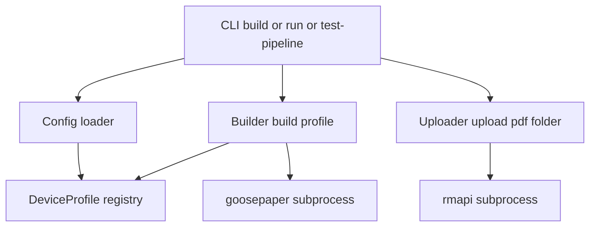

# Design Document — device-profiles

## Overview

**Purpose**: Extend the `daily-paper` pipeline with a configurable **device profile** so the same renewsable deployment can emit PDFs tuned for the reMarkable 2 and the reMarkable Paper Pro Move in the same run, optionally to different reMarkable cloud folders, with color preserved on devices that display it.

**Users**: Two operator personas — the existing rM 2 user (unchanged behaviour by default) and the new Paper Pro Move user. A single operator may serve both from one deployment.

**Impact**: Adds a `DeviceProfile` concept to Config, a per-profile CSS file that drives the goosepaper `--style` machinery, and a CLI-level loop over configured profiles. No new components, no new external dependencies. The `daily-paper` spec's Out-of-Boundary items (rendering engine, reMarkable protocol, scheduler) are unchanged.

### Goals
- `device_profile` (or `device_profiles`) config field with `rm2` (default) and `paper_pro_move` built-in values.
- Profile-tuned `@page size` produces correctly-sized PDFs on each device.
- Existing configs work unchanged.
- Color preserved on Paper Pro Move; opt-out via profile flag.
- Single scheduled run produces one PDF per configured profile, optionally to per-profile folders.

### Non-Goals
- New reMarkable devices beyond rm2 and paper_pro_move.
- Broadsheet typography / font selection changes beyond page-size-tuned font defaults.
- Gallery 3 color-palette calibration.
- Schedule / upload protocol / CLI-surface changes beyond passing a profile through existing commands.

## Boundary Commitments

### This Spec Owns
- The `DeviceProfile` value object and the built-in profile registry (`rm2`, `paper_pro_move`).
- Per-profile CSS files shipped as package data under `src/renewsable/styles/`.
- Config schema additions (`device_profile` shorthand, `device_profiles` list) and their validation.
- Builder's profile parameter and the temp-`styles/` directory + CWD handling when invoking goosepaper.
- Filename suffixing rule (every build's output is `renewsable-YYYY-MM-DD-<profile>.pdf`; suffix always present).
- CLI-level iteration over profiles in `build`, `run`, `upload` (default), `test-pipeline`.
- Backward-compatible config loading so pre-upgrade configs keep working.

### Out of Boundary
- goosepaper's rendering internals beyond passing `--style`.
- WeasyPrint's `@page` behaviour.
- reMarkable cloud protocol (still owned by rmapi).
- Scheduler (unchanged — the timer still calls `renewsable run`).
- Pairing (unchanged).
- Logging setup (unchanged; profiles log at existing levels).

### Allowed Dependencies
- `daily-paper` spec's Config, Builder, Uploader, CLI components (extended, not replaced).
- Python stdlib (`copy`, `tempfile`, `importlib.resources`, `pathlib`).
- goosepaper's `--style` flag semantics (**revalidation trigger** if upstream changes them).
- WeasyPrint's CSS Paged Media support.

### Revalidation Triggers
- goosepaper's style-loading path (`pathlib.Path("./styles/") / style`) changes.
- goosepaper's `--style` CLI flag is renamed or removed.
- reMarkable releases a new device whose form factor invalidates the `rm2` / `paper_pro_move` classification.
- Config schema adds a field that conflicts with `device_profile` / `device_profiles`.
- Filename format change (affects downstream systemd-timer evidence in `PI_VERIFICATION.md`).

## Architecture

### Architecture Pattern & Boundary Map

Extension of the existing layered orchestrator. One new value object, one extended loader, one extended subprocess invocation, one CLI loop.



Key integration points:
- **Config** gains `device_profiles: list[DeviceProfile]`. Loader normalises shorthand and list forms.
- **Builder.build** takes a `DeviceProfile` parameter; writes the profile's CSS into a temp `styles/` directory; runs goosepaper with `cwd=<tmpdir>` and `--style <profile.name>`.
- **CLI** loops `for profile in config.device_profiles: Builder.build(profile) → Uploader.upload(pdf, profile.remarkable_folder)`. Failure isolation wraps each iteration.

### Technology Stack

| Layer | Choice / Version | Role | Notes |
|-------|------------------|------|-------|
| Config | Python frozen dataclass | Holds `list[DeviceProfile]` | No new lib |
| Profile registry | Pure Python dict | Built-in `rm2` + `paper_pro_move` | Module-level constant |
| Profile CSS | Runtime-generated via `profiles.render_css` | Per-profile `@page size` + optional mono filter | No static files; written into a per-run tempdir |
| Rendering | goosepaper 0.7.1 (pinned fork) | Applies the profile CSS via `--style` | Unchanged |
| PDF | WeasyPrint 60+ (transitive via goosepaper) | Honours `@page size` from profile CSS | Unchanged |

## File Structure Plan

### Directory Structure
```
src/
└── renewsable/
    ├── profiles.py                     # NEW: DeviceProfile dataclass + registry +
    │                                   #      resolver + render_css(profile) -> str
    ├── config.py                       # MODIFIED: device_profile(s) loading + validation
    ├── builder.py                      # MODIFIED: build(profile, today=None); temp styles/ dir
    └── cli.py                          # MODIFIED: iterate over config.device_profiles

tests/
├── test_profiles.py                    # NEW: registry + resolver + render_css goldens
├── test_config.py                      # MODIFIED: device_profile(s) loading cases
├── test_builder.py                     # MODIFIED: profile plumbing + argv/CWD assertions
└── test_cli.py                         # MODIFIED: multi-profile iteration + failure isolation
```

**Note on CSS handling**: profile CSS is **generated at runtime** by `profiles.render_css(profile)`. No static `.css` files are shipped with the wheel — this is deliberate so operator overrides (page dimensions, margins, font sizes, colour toggle) are always reflected in the rendered CSS without the possibility of stale on-disk files. Builder writes the rendered string into `<tmpdir>/styles/<profile.name>.css` per run, then goosepaper's `--style` resolver picks it up.

### Modified Files
- `config/config.example.json` — **optional** annotation only; no schema change. README gets a "Device profiles" section.
- `README.md` — add "Device profiles" subsection under Configuration reference, plus an upgrade note about the one-time orphan PDF.
- **Not** `pyproject.toml` — no new package-data entries; CSS is runtime-generated.

## System Flows

### Single scheduled run, two profiles configured

```mermaid
sequenceDiagram
    participant Timer as systemd timer
    participant CLI as renewsable run
    participant Config
    participant Builder
    participant Goosepaper as goosepaper (subproc)
    participant Uploader
    participant Rmapi as rmapi (subproc)

    Timer->>CLI: run
    CLI->>Config: load(path)
    Config-->>CLI: Config with 2 profiles
    loop per profile [rm2, paper_pro_move]
      CLI->>Builder: build(profile)
      Builder->>Builder: write tmp/styles/<p>.css
      Builder->>Goosepaper: cwd=tmp; goosepaper --style <p> -c ... -o <p-suffixed>.pdf
      Goosepaper-->>Builder: exit 0 PDF
      Builder-->>CLI: pdf path
      CLI->>Uploader: upload(pdf, profile.remarkable_folder)
      Uploader->>Rmapi: rmapi put --force
    end
    CLI-->>Timer: exit 0 if all profiles succeeded, else 1
```

**Key decisions**:
- Per-profile failure does not abort the loop; CLI collects outcomes and sets exit code at the end.
- Every build's output filename is `renewsable-YYYY-MM-DD-<profile>.pdf` — uniform rule regardless of how many profiles are configured.

## Requirements Traceability

| Req | Summary | Components | Interfaces / Flows |
|-----|---------|------------|---------------------|
| 1.1 | Declare device profile in config | Config, profiles | `Config.device_profiles: list[DeviceProfile]`; loader |
| 1.2 | Accept `rm2` and `paper_pro_move` | profiles | `BUILTIN_PROFILES` registry |
| 1.3 | Default to `rm2` when unspecified | Config | Loader fallback |
| 1.4 | Unknown profile → fail naming invalid value + supported set | Config, profiles | `ConfigError` with listed options |
| 2.1 | rm2 page size tuned to 10.3" | `profiles.render_css(rm2)` | `@page { size: 6.18in 8.23in; ... }` |
| 2.2 | paper_pro_move page size tuned to 7.3" | `profiles.render_css(paper_pro_move)` | `@page { size: 4.38in 5.84in; ... }` |
| 2.3 | Portrait regardless of profile | profiles registry | Width < height in every built-in |
| 2.4 | Page dimensions apply to every page | `profiles.render_css` + WeasyPrint | `@page` without selectors applies globally |
| 3.1 | Ship built-in named profiles | profiles registry | `BUILTIN_PROFILES` + package-data CSS |
| 3.2 | Selecting a built-in requires no extra fields | Config loader | Override merging |
| 3.3 | Document page dimensions per built-in | README | Configuration reference table |
| 4.1 | Pre-upgrade config produces equivalent reading experience (same content, new filename form) | Config loader + filename rule | `renewsable-YYYY-MM-DD-rm2.pdf` for the default single-profile case; one-time post-upgrade orphan documented in README |
| 4.2 | No config edits required on upgrade | Config loader | Shorthand + implicit default |
| 4.3 | No warnings for omitted profile fields | Config loader | DEBUG-level log only |
| 5.1 | Preserve color on `paper_pro_move` | `profiles.render_css(paper_pro_move)` | No grayscale filter by default |
| 5.2 | `rm2` renders mono on its target device | rm2 physical device grayscales on display; PDF bytes stay color by default for Req 4.1 byte-compatibility | Operator may opt the rm2 profile into strict-mono PDF via `"color": false` override |
| 5.3 | Operator override via config flag | `profiles.render_css` | `DeviceProfile.color: bool`; CSS written conditionally |
| 6.1 | Multi-profile produces one PDF per profile | CLI | Per-profile loop |
| 6.2 | Filename includes profile when multi-profile | Builder | Suffix rule |
| 6.3 | Partial failures tolerated with non-zero exit | CLI | try/except + failure flag |
| 7.1 | Per-profile destination folder | profiles + Uploader | `DeviceProfile.remarkable_folder`; CLI passes it to `Uploader.upload(folder=...)` |
| 7.2 | Fallback to default folder | Uploader | Existing default behaviour |
| 8.1 | `limit` unchanged by profile | Builder + profiles | Profile never reads or modifies `stories[].config.limit` |
| 8.2 | Same story count per feed across profiles | Builder | Feed pre-fetch happens once per profile, but `limit` is identical |
| 9.1 | Unknown profile in per-profile config → error | Config loader | `ConfigError` with name + supported set |
| 9.2 | Duplicate profile in multi-profile list → error | Config loader | Set-based duplicate check |
| 9.3 | Malformed profile-field types → error | Config loader | Type-check per field |
| 9.4 | Errors surface before any feed fetch or upload | Config loader | Validation runs at `Config.load` |

## Components and Interfaces

| Component | Domain/Layer | Intent | Req Coverage | Key Dependencies (P0/P1) | Contracts |
|-----------|--------------|--------|--------------|--------------------------|-----------|
| `profiles.DeviceProfile` | Config / value object | Per-device render settings | 1.1–1.4, 3.1–3.3, 5.1–5.3, 7.1 | Config (P0) | State |
| `profiles.BUILTIN_PROFILES` / `profiles.resolve` | Config / registry | Named profile resolution + override merging | 1.2, 1.3, 3.1, 3.2, 9.1 | DeviceProfile (P0) | Service |
| `config.Config` (extension) | Config | Normalise three config shapes into `list[DeviceProfile]` | 1.1, 1.3, 4.1–4.3, 9.1–9.4 | profiles (P0) | Service, State |
| `builder.Builder` (extension) | Orchestration | Build one PDF for a given profile | 2.1–2.4, 5.1, 5.2, 6.2, 8.1, 8.2 | profiles (P0), goosepaper (P0) | Service |
| `cli.main` (extension) | Entrypoint | Loop profiles; isolate per-profile failures | 6.1, 6.3, 7.1, 7.2 | Builder (P0), Uploader (P0) | Service |
| `profiles.render_css` | Pure function | `@page` + font + color rules per device, generated at runtime | 2.1, 2.2, 2.3, 2.4, 5.1, 5.2 | goosepaper (P0) | Service |

Detail blocks for components that introduce a new boundary follow.

---

### Config / profiles

#### `profiles.DeviceProfile`
| Field | Detail |
|-------|--------|
| Intent | Immutable per-device render settings |
| Requirements | 1.1–1.4, 3.1–3.3, 5.1–5.3, 7.1 |

**Responsibilities & Constraints**
- Frozen dataclass. No behaviour beyond construction + equality.
- Holds: `name`, `page_width_in`, `page_height_in`, `margin_in`, `font_size_pt`, `color: bool`, `remarkable_folder: str | None`.
- `remarkable_folder=None` means "fall back to `Config.remarkable_folder`".

##### Service Interface (Python)
```python
from dataclasses import dataclass

@dataclass(frozen=True)
class DeviceProfile:
    name: str
    page_width_in: float
    page_height_in: float
    margin_in: float
    font_size_pt: int
    color: bool = True
    remarkable_folder: str | None = None
```

Invariants (validated in `profiles.resolve`, not in the dataclass):
- `name` matches `^[a-z][a-z0-9_]{0,31}$`.
- Dimensions, margin, font size are positive.
- `remarkable_folder`, when set, starts with `/`.

#### `profiles` module-level helpers

```python
BUILTIN_PROFILES: dict[str, DeviceProfile] = {
    "rm2": DeviceProfile(
        name="rm2",
        page_width_in=6.18,
        page_height_in=8.23,
        margin_in=0.35,
        font_size_pt=12,
        color=True,               # keep the PDF bytes color-preserving so
                                  # the upgrade is byte-compatible with
                                  # pre-profile renewsable; the rm2 device
                                  # grayscales on display anyway. An operator
                                  # who wants strict-mono PDFs sets color=false.
    ),
    "paper_pro_move": DeviceProfile(
        name="paper_pro_move",
        page_width_in=4.38,
        page_height_in=5.84,
        margin_in=0.25,
        font_size_pt=11,
        color=True,               # Paper Pro Move has color e-ink
    ),
}

def resolve(name: str, overrides: dict[str, Any] | None = None) -> DeviceProfile:
    """Return the built-in profile `name` with optional field overrides
    shallow-merged on top. Raises ConfigError for unknown names or invalid
    override values. Overrides may not change `name`."""

def render_css(profile: DeviceProfile) -> str:
    """Return a CSS string with the profile's @page, margin, font-size,
    and (if `color` is False) a grayscale filter."""
```

**Dependencies**
- Inbound: Config loader, Builder (P0)
- External: none (pure Python)

**Contracts**: Service [x] / State [x]

##### `render_css` output sketch
```css
@page {
  size: {page_width_in}in {page_height_in}in;
  margin: {margin_in}in;
}
html, body { font-size: {font_size_pt}pt; }
/* when profile.color is False: */
html, body { filter: grayscale(100%); }
img, svg { filter: grayscale(100%); }
```

**Implementation Notes**
- `resolve` is the single validation point for profile names and overrides — keeps `Config.load` thin.
- `render_css` is deterministic; golden-string tests cover both color-on and color-off.
- No stored state beyond the registry dict.

---

### Config (extension)

#### `config.Config.device_profiles: list[DeviceProfile]`
| Field | Detail |
|-------|--------|
| Intent | Canonical list of profiles this run will build for |
| Requirements | 1.1, 1.3, 4.1–4.3, 9.1–9.4 |

**Responsibilities & Constraints**
- Appears as a new field on the frozen `Config` dataclass; loader populates it; rest of the codebase reads it.
- `Config.load` accepts three input shapes (none / shorthand / list) and always produces a non-empty list.
- Validation errors use `ConfigError` with the file path + field name per the existing Config convention.

##### Service Interface (Python additions)
```python
@dataclass(frozen=True)
class Config:
    ...                                    # existing fields unchanged
    device_profiles: list[DeviceProfile] = field(default_factory=lambda: [BUILTIN_PROFILES["rm2"]])
```

**Loading rules** (inside the existing `Config.load` / `_apply_defaults` path):
| Input JSON | Normalised `device_profiles` |
|------------|------------------------------|
| no profile key | `[BUILTIN_PROFILES["rm2"]]` |
| `"device_profile": "paper_pro_move"` | `[resolve("paper_pro_move")]` |
| `"device_profile": {"name": "rm2", "remarkable_folder": "/Papers"}` | `[resolve("rm2", overrides)]` |
| `"device_profiles": [ ... ]` | `[resolve(name, overrides) for each entry]` |

**Validation**:
- Rejects unknown profile names with `ConfigError` naming the value and listing `BUILTIN_PROFILES.keys()`.
- Rejects duplicate names within `device_profiles`.
- Rejects malformed shape (e.g. `device_profile` that's neither string nor object; `device_profiles` that's not a list).
- Rejects config that declares both `device_profile` and `device_profiles`.

**Dependencies**
- Inbound: CLI (P0), Builder (P0)
- External: `profiles.resolve` (P0)

**Contracts**: Service [x] / State [x]

**Implementation Notes**
- Default factory preserves Req 4.1 (identical behaviour for pre-upgrade configs that omit profile fields).
- No warning-level log on the default-applied path (Req 4.3); log at DEBUG only.

---

### Builder (extension)

#### `builder.Builder.build(profile, today=None)` — signature change
| Field | Detail |
|-------|--------|
| Intent | Produce a PDF for a specific profile |
| Requirements | 2.1–2.4, 5.1, 5.2, 6.2, 8.1, 8.2 |

**Signature** (replaces the current single-profile form):
```python
def build(self, profile: DeviceProfile, today: datetime.date | None = None) -> Path:
    """Build the PDF for `profile`. Returns the output path. Raises BuildError."""
```

**Responsibilities & Constraints**
- Same feed pre-fetch + robots + retry behaviour as today (inherited unchanged).
- New steps before invoking goosepaper:
  1. Build the filename: always `renewsable-<today>-<profile.name>.pdf`, regardless of how many profiles the config declares.
  2. Write the profile CSS to `<tmpdir>/styles/<profile.name>.css` using `profiles.render_css(profile)`.
  3. Invoke goosepaper with `cwd=<tmpdir>` and extra argv `--style <profile.name>`.
- Does **not** modify `stories[].config.limit` (Req 8.1). Feed pre-fetch runs once per profile; the fetched bytes are written fresh into each per-profile tempdir so profile builds stay independent.

**Dependencies**
- Inbound: CLI (P0)
- Outbound: Config (P0), profiles (P0), goosepaper subprocess (P0)

**Contracts**: Service [x]

**Implementation Notes**
- `cwd` is already the CLI's CWD by default; the change is to pass `cwd=<tmpdir>` explicitly to `subprocess.run`.
- The temp styles/ directory lives inside the Builder's existing `TemporaryDirectory`; nothing persists across invocations.

---

### CLI (extension)

#### `cli.build`, `cli.run`, `cli.test-pipeline` — loop over profiles

**Responsibilities & Constraints**
- Replace each command's single-profile body with:
  ```python
  any_failed = False
  for profile in config.device_profiles:
      try:
          pdf = Builder(config).build(profile)
          click.echo(str(pdf))
          if this_is_run_or_test_pipeline:
              folder = profile.remarkable_folder or config.remarkable_folder
              Uploader(config).upload(pdf, folder=folder)
      except RenewsableError as exc:
          any_failed = True
          logger.error("profile %s failed: %s", profile.name, exc)
          click.echo(str(exc), err=True)
  if any_failed:
      ctx.exit(1)
  ```
- `cli.upload PATH`: unchanged single-file behaviour (operator supplies the file and an optional `--folder`).

**Dependencies**
- Inbound: shell / systemd timer
- Outbound: Config, Builder, Uploader (all P0)

**Contracts**: Service [x]

**Implementation Notes**
- Keeps exit-code semantics from the `daily-paper` spec: 0 success, 2 ConfigError, 1 any other (including "at least one profile failed").
- Logging levels unchanged (INFO on success, ERROR on failure).

---

### Profile CSS — generated at runtime

CSS is produced by `profiles.render_css(profile)` and written by Builder into `<tmpdir>/styles/<profile.name>.css`. **No static `.css` files are shipped with the wheel.** Operators' overrides (page dimensions, margins, font sizes, colour toggle) are always reflected verbatim in the rendered CSS — there is no possibility of a stale on-disk version drifting from the dataclass.

Sample output for documentation (what the built-ins render to with no overrides):

`rm2` (`color=True`, no grayscale filter):
```css
@page { size: 6.18in 8.23in; margin: 0.35in; }
html, body { font-size: 12pt; }
```

`paper_pro_move` (`color=True`, no grayscale filter):
```css
@page { size: 4.38in 5.84in; margin: 0.25in; }
html, body { font-size: 11pt; }
```

With `color=false` on either profile, `render_css` additionally emits:
```css
html, body { filter: grayscale(100%); }
img, svg { filter: grayscale(100%); }
```

Golden-string tests in `tests/test_profiles.py` pin the exact output so any accidental change is caught.

## Data Models

No persistent data beyond the existing `Config` / filesystem artefacts. The new state-at-rest:
| Artefact | Owner | Location |
|----------|-------|----------|
| Profile CSS (per-run, ephemeral) | Builder | `<tmpdir>/styles/<profile>.css` |
| Config (includes `device_profiles` list) | Config loader | `$XDG_CONFIG_HOME/renewsable/config.json` |
| PDF output (per-profile) | Builder | `<output_dir>/renewsable-<date>-<profile>.pdf` (suffix always present) |

## Error Handling

### Error Strategy
- All new failure modes raise `ConfigError` or `BuildError` from the existing hierarchy. No new exception classes.
- Partial-failure semantics in the CLI loop: per-profile errors logged + surfaced via stderr; final exit code reflects worst outcome.

### Error Categories and Responses
- **Unknown profile name / malformed profile-related fields**: `ConfigError` with path + field + supported values; exit 2.
- **Profile CSS missing from package data** (shouldn't happen post-install): `ConfigError`-style bootstrap failure at `profiles.render_css`; fail-fast with a message naming `profile.name`.
- **Goosepaper non-zero under profile**: existing `BuildError` behaviour; CLI marks the profile failed and continues with the next.
- **Upload failure under per-profile folder**: existing `UploadError` behaviour; CLI marks the profile failed.

## Testing Strategy

Derived from Req acceptance criteria.

### Unit Tests
1. `profiles.resolve("rm2")` returns a `DeviceProfile` with the documented rm2 defaults; unknown name raises `ConfigError` naming supported set. (Req 1.2, 1.4)
2. `profiles.resolve("paper_pro_move", overrides={"remarkable_folder": "/News-Move"})` returns a profile with the folder overridden and every other field from the built-in. (Req 7.1)
3. `profiles.render_css(profile)` returns a CSS string containing the expected `@page size` for each built-in; color=False injects the grayscale filter. (Req 2.1, 2.2, 5.2)
4. `Config.load` normalises the three input shapes into the correct `device_profiles` list. Verify against fixture JSON. (Req 1.1, 1.3, 4.1, 4.2)
5. `Config.load` rejects: unknown profile name, duplicates in `device_profiles`, both `device_profile` and `device_profiles` declared. (Req 9.1, 9.2, 9.4)

### Integration Tests
1. `Builder.build(profile_rm2)` invokes goosepaper with `cwd=<tmpdir>`, `--style rm2`, and the tmpdir contains `styles/rm2.css` with the runtime-rendered CSS. Filename is `renewsable-<date>-rm2.pdf` regardless of single-profile vs multi-profile config. (Req 2.4, 4.1, 6.2)
2. `Builder.build(profile_ppm)` with a two-profile config produces `renewsable-<date>-paper_pro_move.pdf`. (Req 6.2)
3. `stories[].config.limit` is unchanged after two sequential builds under different profiles (Req 8.1, 8.2).

### CLI Tests
1. `renewsable run` with a two-profile config invokes Builder+Uploader twice in order; each upload targets the profile's resolved folder (Req 6.1, 7.1).
2. `renewsable run` when the first profile's Builder raises `BuildError`: the second profile still builds; exit code is 1; stderr contains both profile names. (Req 6.3)
3. `renewsable run` with a legacy single-profile config (no profile-related fields) produces one PDF named `renewsable-<date>-rm2.pdf`, uploads to `config.remarkable_folder`, and logs at DEBUG (not WARNING) that the default rm2 profile was applied. (Req 4.1, 4.2, 4.3)

### E2E / Smoke
- On-Pi smoke addendum: extend `PI_VERIFICATION.md` with a "two-profile run" step that verifies two dated+suffixed PDFs land in their respective reMarkable folders.

## Security Considerations

- No new credential surfaces. rmapi token path is unchanged.
- Per-profile `remarkable_folder` values flow through Config validation (must start with `/`, no shell metacharacters beyond the existing check) — same checks as the base folder.
- Profile names are constrained to `^[a-z][a-z0-9_]{0,31}$` to prevent path-traversal when written to `<tmpdir>/styles/<name>.css`.

## Performance & Scalability

- Two profiles ≈ two runs of the pipeline. On a Pi 4 this is ~1–3 minutes per profile. Acceptable for a daily cron.
- Feed pre-fetch is not deduplicated across profiles in this spec (each profile re-fetches). A follow-on spec can cache feed bytes across profiles if the scheduling window becomes tight.

## Migration Strategy

No schema migration; config is backward-compatible. Existing configs continue to produce equivalent content because:
- `Config.load` without profile fields → implicit `[BUILTIN_PROFILES["rm2"]]`.
- Default rm2 profile has `color=True`, so PDF bytes are byte-compatible with pre-upgrade output (Req 4.1).
- Upload folder semantics unchanged for single-profile configs.

One-time filename transition:
- Pre-upgrade filename: `renewsable-YYYY-MM-DD.pdf`.
- Post-upgrade filename: `renewsable-YYYY-MM-DD-rm2.pdf`.
- The un-suffixed file from the last pre-upgrade run is stranded on the reMarkable cloud; the operator deletes it once on the tablet. Subsequent days converge to the new filename.

README gets an "Upgrade note" block explaining the transition. `PI_VERIFICATION.md` gets a one-line filename-format update plus a new two-profile step.
