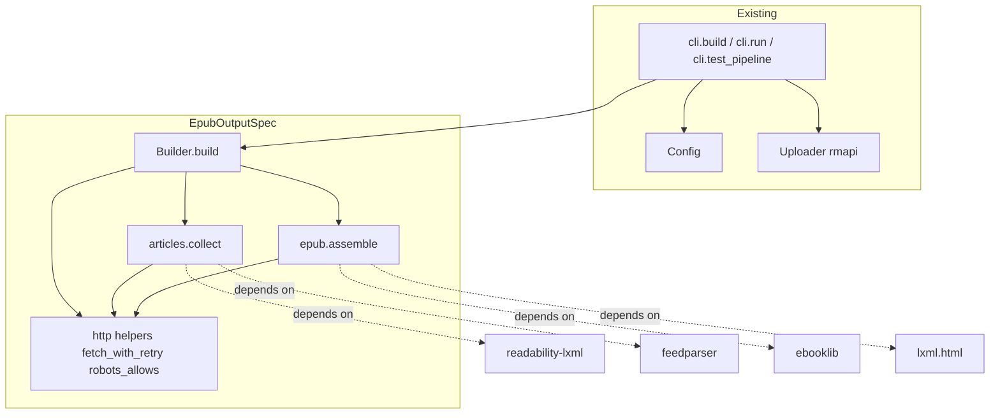
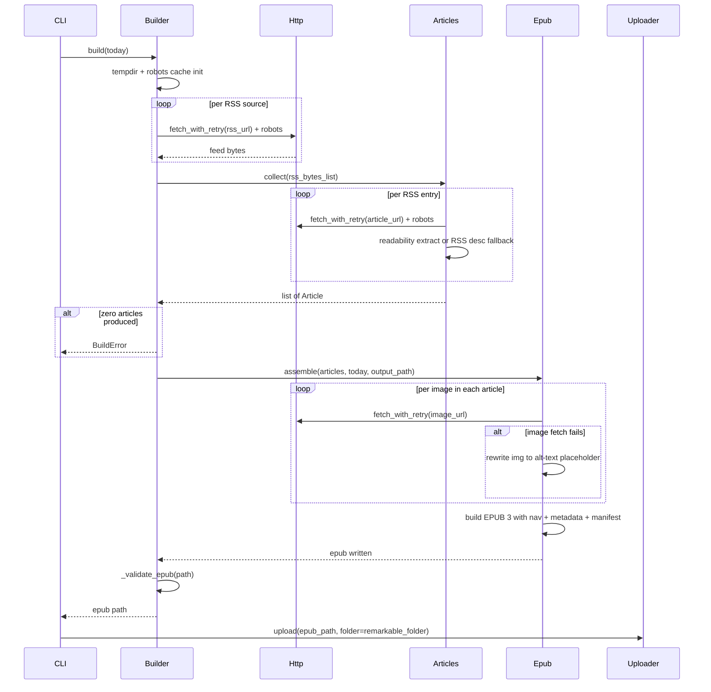

# Design Document — `epub-output`

## Overview

**Purpose**: Replace renewsable's PDF output (built via the `goosepaper` subprocess + WeasyPrint) with a directly-built EPUB 3 file, owned end-to-end by renewsable. The EPUB carries an EPUB-nav table of contents, embeds images as internal resources with a visible alt-text fallback when fetch fails, and is uploaded to reMarkable using the same `rmapi` path that PDFs used.

**Users**: The single operator running renewsable on a Raspberry Pi via the daily systemd timer. Downstream readers consume the EPUB on a reMarkable 2 (or any EPUB reader).

**Impact**: Removes goosepaper, WeasyPrint, and the `rmapy` transitive dependency from the runtime; deletes the device-profile CSS rendering layer; collapses multi-profile output to a single file per run; switches the build's central work from "shell out to goosepaper" to "fetch articles + assemble EPUB in-process". All retry/robots/UA infrastructure is preserved and reused.

### Goals
- Produce one valid EPUB 3 per run at `<output_dir>/renewsable-<YYYY-MM-DD>.epub`, with EPUB-nav TOC, embedded images, and standard metadata.
- Remove every goosepaper code path and dependency.
- Keep article fetch and image fetch under the existing UA, robots.txt, and bounded retry/backoff regime.

### Non-Goals
- Producing PDF in any form, behind any flag, ever again.
- An inline TOC page inside the book body (only the EPUB-nav document).
- A generated cover image.
- Per-device page sizes, margins, or font-size CSS — meaningless for a reflowable format.
- Multi-output per run; per-profile reMarkable folders.
- Stylesheet customization or typographic tuning beyond ebooklib defaults.

## Boundary Commitments

### This Spec Owns
- The full daily-paper build pipeline post-feed-fetch: article fetch + main-content extraction, image fetch + embedding, EPUB 3 assembly (manifest, spine, nav, metadata), and EPUB validation.
- The output filename contract `renewsable-<YYYY-MM-DD>.epub` and same-date overwrite behavior.
- Removal of goosepaper, `rmapy`, profile-CSS rendering, and goosepaper-specific config keys.
- The article-extraction fallback chain (extracted body → RSS description/content → drop article).
- The image-failure fallback (`` → visible alt-text placeholder).

### Out of Boundary
- The `Uploader` (file-type-agnostic; reused unchanged).
- The Scheduler, Pairing, logging, paths, and CLI-bootstrap subsystems.
- RSS feed pre-fetch over HTTP (already owned by `Builder._prepare_stories`; logic stays, but the file:// rewrite is dropped because RSS is now parsed in-process).
- Cover image generation, EPUB stylesheet authoring, EPUB 2 compatibility.
- Any device-profile concept (fully removed; not deferred — explicitly out of scope in the EPUB world).

### Allowed Dependencies
- `ebooklib` (new runtime dep) — EPUB 3 assembler.
- `feedparser` (new runtime dep) — RSS/Atom parser.
- `readability-lxml==0.8.1` (already declared) — main-content extraction.
- `lxml` / `lxml_html_clean` (already transitive) — HTML walking and image-tag rewriting.
- Stdlib only for HTTP, robots.txt, ZIP validation.
- `Uploader` — consumed via existing `Uploader.upload(path, folder=...)` interface; this design must not change that contract.

### Revalidation Triggers
- Any change to `Builder.build` signature or return type → CLI revalidation (`build`, `run`, `test-pipeline`).
- Output filename pattern changes → `Uploader` default-path callers and any downstream tooling (none today besides `cli._todays_pdf_path`, which this design renames and updates).
- Adding back per-profile output → `daily-paper` and `device-profiles` specs require coordinated reopening.
- Article-fetch contract changes (e.g., dropping the RSS-description fallback) → daily-paper spec Req 2.2 ("every successful feed is included") must be revisited.

## Architecture

### Existing Architecture Analysis

Renewsable today is a thin orchestrator: `Config` → `Builder` (subprocess to goosepaper) → `Uploader` (subprocess to rmapi). The Builder holds an in-memory robots cache and uses module-level `subprocess`, `urllib_request`, `_time` aliases as monkeypatch seams. `BuildError` always cleans up half-written artefacts before raising. `Uploader` accepts any file path; the variable name "pdf" is cosmetic. The CLI iterates `config.device_profiles`.

This design preserves every pattern (frozen-dataclass config, module-level seams, `BuildError` cleanup contract, retry/backoff helpers) and replaces only the two pieces that must change: (1) the goosepaper subprocess + PDF validation, and (2) the multi-profile loop in the CLI.

### Architecture Pattern & Boundary Map



**Selected pattern**: pipeline orchestrator with two new domain modules (`articles`, `epub`) plus a thin shared `http` module. Builder remains the single entry point; the article and EPUB modules expose pure functions consumed by Builder.

**Dependency direction (enforced)**: `errors` → `config` → `http` → `articles`, `epub` → `builder` → `cli`. No upward imports. `articles` and `epub` are siblings and must not import each other.

**New components rationale**:
- `articles` — article fetch + readability extraction + RSS-description fallback is the substantive new logic; isolating it makes test seams obvious and keeps `Builder` small.
- `epub` — EPUB 3 assembly with image embedding; isolated because ebooklib usage is the single concentrated point of vendor coupling.
- `http` — `fetch_with_retry` + `robots_allows` are now used from three call sites (RSS pre-fetch, article fetch, image fetch); promoting them out of `Builder` removes a circular-import risk and keeps the monkeypatch seam in one file.

**Steering compliance**: no steering files exist; design follows established codebase conventions (frozen dataclasses, module-level seams, `BuildError` with remediation, closed-set config keys).

### Technology Stack

| Layer | Choice / Version | Role | Notes |
|---|---|---|---|
| CLI | `click>=8.1` (existing) | Command surface | `build` / `run` / `test-pipeline` lose the per-profile loop |
| Build runtime | `ebooklib` (new, latest stable) | EPUB 3 assembler with native nav support | Pure-Python; pip-installable on the Pi |
| Build runtime | `feedparser` (new, latest stable) | RSS/Atom parsing in-process | Replaces goosepaper's RSS provider; pure-Python |
| Build runtime | `readability-lxml==0.8.1` (existing pin) | Main-content extraction from article HTML | Pin reason already documented in `pyproject.toml`; keep pin |
| Build runtime | `lxml` + `lxml_html_clean` (existing) | HTML walking, image-tag rewriting, sanitization | Already transitive via readability |
| Removed | `goosepaper` (git pin), `rmapy` | — | Both deleted from `pyproject.toml` |
| Upload | `rmapi` binary (existing) | reMarkable cloud upload | Treats `.epub` and `.pdf` identically; behavior unchanged |
| HTTP | `urllib.request` (stdlib) | All fetches (RSS, article, image, robots.txt) | Continues the no-third-party-HTTP convention |

## File Structure Plan

### Directory Structure
```
src/renewsable/
├── http.py             # NEW: fetch_with_retry, robots_allows, RobotsCache
├── articles.py         # NEW: Article record + collect() over stories
├── epub.py             # NEW: assemble() — image embed + EPUB 3 build
├── builder.py          # MODIFIED: drop goosepaper path, orchestrate articles+epub
├── config.py           # MODIFIED: drop goosepaper_bin, font_size, subprocess_timeout_s, device_profiles
├── cli.py              # MODIFIED: collapse profile loop, rename _todays_pdf_path
├── profiles.py         # DELETED
├── errors.py           # unchanged
├── uploader.py         # unchanged (file-type-agnostic)
├── scheduler.py        # unchanged
├── pairing.py          # unchanged
├── paths.py            # unchanged
├── logging_setup.py    # unchanged
└── __main__.py         # unchanged
tests/
├── test_http.py        # NEW: covers what test_builder used to cover for fetch/robots
├── test_articles.py    # NEW
├── test_epub.py        # NEW
├── test_builder.py     # REWRITTEN: orchestration only, no PDF/goosepaper tests
├── test_config.py      # MODIFIED: drop goosepaper/font_size/device_profiles tests
├── test_cli.py         # MODIFIED: drop multi-profile assertions
├── test_profiles.py    # DELETED
└── (other tests)       # unchanged
pyproject.toml          # MODIFIED: drop goosepaper, rmapy; add ebooklib, feedparser
```

### Modified Files
- `src/renewsable/builder.py` — Replace `_prepare_stories` (drop file:// rewrite), `_write_goosepaper_config`, `_run_goosepaper`, `_validate_pdf` with calls into `articles.collect` and `epub.assemble`, plus `_validate_epub`. `Builder.build(today=None)` loses the `profile` parameter and returns the single EPUB path.
- `src/renewsable/config.py` — Remove fields `goosepaper_bin`, `font_size`, `subprocess_timeout_s`, `device_profiles` and the `device_profile`/`device_profiles` input-only keys; remove related validators in `_TYPE_RULES` / `_apply_defaults` / `_normalise_device_profiles`. `remarkable_folder` is now the single upload target.
- `src/renewsable/cli.py` — `build`, `run`, `test-pipeline` call `Builder(config).build()` once (no loop). Rename `_todays_pdf_path` → `_todays_epub_path` returning `<output_dir>/renewsable-<YYYY-MM-DD>.epub`. `upload`'s default path becomes the EPUB.
- `pyproject.toml` — Remove `goosepaper`, `rmapy`. Add `ebooklib` and `feedparser`. Update project description to "Daily news digest EPUB pipeline …".

### Deletions
- `src/renewsable/profiles.py` and `tests/test_profiles.py` — every field of `DeviceProfile` is either obsolete (page dims, margin, font size, color) or replaceable by a single top-level config key (`remarkable_folder`).

## System Flows



**Key decisions**:
- **No file:// rewrite**: in-process RSS parsing via `feedparser` consumes bytes directly, so the temp-file rewrite goosepaper required is gone.
- **Image failure is per-image local**: an image fetch failure mutates the article's HTML in place (replace `` with a `<span class="renewsable-missing-image">` carrying the original alt and the URL) and the build continues (Req 4.3, 4.4).
- **Article failure is per-article local**: RSS-description fallback first; if both extracted body and RSS description are unusable, the article is dropped (Req 3.3, 3.4). The build fails only when *every* article is dropped (Req 3.5).
- **Validation is post-write**: `_validate_epub` opens the produced file as a ZIP, asserts the first entry is `mimetype` with content `application/epub+zip` (stored uncompressed per EPUB spec), and asserts `META-INF/container.xml` exists. On any failure the file is unlinked before `BuildError` is raised, mirroring the existing PDF-cleanup pattern.

## Requirements Traceability

| Requirement | Summary | Components | Interfaces | Flows |
|---|---|---|---|---|
| 1.1 | One EPUB per run | `Builder` | `Builder.build` | Sequence above |
| 1.2 | Valid EPUB 3 | `epub.assemble`, `Builder._validate_epub` | `epub.assemble`, `_validate_epub` | "build EPUB 3 with nav…" + "validate" steps |
| 1.3 | Never PDF | `pyproject.toml`, `Builder` | n/a | Goosepaper path removed from sequence |
| 1.4 | Missing/empty/invalid → BuildError, no partial | `Builder._validate_epub` | `_validate_epub` | "validate" step |
| 2.1 | No goosepaper subprocess | `Builder` | n/a | Sequence has no goosepaper participant |
| 2.2 | No goosepaper dependency | `pyproject.toml` | n/a | n/a |
| 2.3 | No PDF tests | `tests/test_builder.py`, `tests/test_profiles.py` | n/a | n/a |
| 2.4 | No goosepaper config keys | `Config`, Stories Schema | `Config.load` closed-set check on top-level + `stories` entry shape | n/a |
| 3.1 | Article URL fetch + extract | `articles.collect` | `articles.collect` | "per RSS entry" loop |
| 3.2 | Same robots/retry for article fetch | `http.fetch_with_retry`, `http.robots_allows` | `fetch_with_retry`, `robots_allows` | "per RSS entry" + "per RSS source" share `Http` |
| 3.3 | RSS-description fallback | `articles.collect` | `articles.collect` | "readability extract or RSS desc fallback" |
| 3.4 | Per-article skip on total failure | `articles.collect` | `articles.collect` | per-article logic |
| 3.5 | Build error if all articles drop | `Builder` | `Builder.build` | "alt zero articles produced" branch |
| 4.1 | Embed images | `articles.collect` (URL resolution), `epub.assemble` | `articles.collect`, `epub.assemble` | "per image" loop |
| 4.2 | Internal paths only | `epub.assemble` | `epub.assemble` | image rewrite step |
| 4.3 | Visible alt-text placeholder | `epub.assemble` | `epub.assemble` | "alt image fetch fails" branch |
| 4.4 | Image failure never fails build | `epub.assemble` | `epub.assemble` | "per image" loop continues |
| 5.1 | Nav with one entry per article | `epub.assemble` | `epub.assemble` | "build EPUB 3 with nav" |
| 5.2 | Nav links work | `epub.assemble` | `epub.assemble` (`book.toc` list of `epub.Link`) | "build EPUB 3 with nav" |
| 5.3 | Nav label = article title | `epub.assemble` | `epub.assemble` | "build EPUB 3 with nav" |
| 6.1 | Title `Renewsable Daily — <date>` | `epub.assemble` | `epub.assemble` | metadata write |
| 6.2 | Author `Renewsable` | `epub.assemble` | `epub.assemble` | metadata write |
| 6.3 | Publication-date metadata = issue date | `epub.assemble` | `epub.assemble` | metadata write |
| 6.4 | Stable language metadata | `epub.assemble` | `epub.assemble` | metadata write |
| 7.1 | One file per run | `Builder`, `cli.build`/`run`/`test-pipeline` | `Builder.build()` (no profile param) | top of sequence |
| 7.2 | Filename without profile suffix | `Builder.build` | `Builder.build` | output_path construction |
| 7.3 | Same-date overwrite | `Builder` | `Builder.build` | `Path.write_bytes` overwrites |
| 8.1 | Upload after successful build | `cli.run`, `cli.test_pipeline` | existing `Uploader.upload` | tail of sequence |
| 8.2 | Replace on cloud | `Uploader` (existing `--force`) | n/a | tail of sequence |
| 8.3 | Existing retry policy | `Uploader` (existing) | n/a | n/a |
| 8.4 | Non-retryable surfaces error | `Uploader` (existing) | n/a | n/a |

## Components and Interfaces

| Component | Domain | Intent | Req Coverage | Key Dependencies | Contracts |
|---|---|---|---|---|---|
| `http` (module) | Networking | Shared fetch + robots primitives with retry/backoff | 3.2, 4.1 | `urllib.request` (P0), `urllib.robotparser` (P0) | Service |
| `articles` (module) | Content | Build per-article records from RSS bytes | 3.1, 3.2, 3.3, 3.4 | `http` (P0), `feedparser` (P0), `readability-lxml` (P0) | Service |
| `epub` (module) | Output | Assemble EPUB 3 (images, nav, metadata) | 1.1, 1.2, 4.x, 5.x, 6.x | `http` (P0), `ebooklib` (P0), `lxml.html` (P0) | Service, Batch |
| `Builder` | Orchestration | Drive pipeline; produce single EPUB | 1.x, 2.1, 3.5, 7.x | `http`, `articles`, `epub`, `Config` (P0) | Service |
| `Config` (modified) | Configuration | Drop goosepaper/profile keys; keep retry/UA/folder | 2.4 | none | State |
| `cli` (modified) | Entry point | Single-call build, no profile loop | 7.1, 8.1 | `Builder`, `Uploader` (P0) | Service |

### Networking

#### `http` module

| Field | Detail |
|---|---|
| Intent | Shared HTTP primitives with bounded retry, robots.txt enforcement, and a per-build cache |
| Requirements | 3.2, 4.1 |

**Responsibilities**: `fetch_with_retry(url, *, ua, retries, backoff_s, timeout_s) -> bytes`; `robots_allows(url, *, cache, ua, timeout_s) -> bool`; `RobotsCache` type alias (`dict[str, RobotFileParser | None]`).

**Dependencies**:
- External: `urllib.request`, `urllib.robotparser` (P0).

**Contracts**: Service.

##### Service Interface
```python
RobotsCache = dict[str, urllib.robotparser.RobotFileParser | None]

def fetch_with_retry(
    url: str,
    *,
    ua: str,
    retries: int,
    backoff_s: float,
    timeout_s: float = 30.0,
) -> bytes: ...

def robots_allows(
    url: str,
    *,
    cache: RobotsCache,
    ua: str,
    timeout_s: float = 30.0,
) -> bool: ...
```
- **Preconditions**: `retries >= 1`, `backoff_s > 0`. `url` is any string; non-http/https schemes return `True` from `robots_allows` (fail-open).
- **Postconditions**: `fetch_with_retry` returns the response body bytes on first success; on exhaustion raises the last underlying exception.
- **Invariants**: The function never sleeps after the final attempt. `robots_allows` mutates `cache` only.

**Implementation Notes**
- Module-level aliases `urllib_request = urllib.request` and `_time = time` preserve the renewsable monkeypatch convention.
- The body of these functions is lifted verbatim from `Builder._fetch_with_retry` and `Builder._robots_allows` (today at `builder.py:429` and `:464`). Behavior must remain bit-for-bit identical so the existing test cases for these primitives still pass after relocation.

### Content

#### `articles` module

| Field | Detail |
|---|---|
| Intent | Turn the configured `stories` list into a list of `Article` records (title, html, image_urls) |
| Requirements | 3.1, 3.2, 3.3, 3.4 |

**Responsibilities**: For each `stories` entry whose `provider == "rss"`, fetch the RSS feed, parse it with `feedparser`, then for each entry (capped at `config.limit` if present, see "Stories Schema" below) fetch the article URL and extract the main body via `readability-lxml`. On any failure of the article-URL fetch *or* extraction, fall back to the entry's `summary`/`content` field. After extraction (regardless of source — extracted body or RSS fallback), resolve every `` and `<a href>` in the article HTML against the article's source URL via `urllib.parse.urljoin`, so the resulting `Article.html` contains only absolute http(s) URLs. If both extraction and RSS fallback are unusable (empty after sanitization), drop the entry and continue.

**Dependencies**:
- Inbound: `Builder` (P0).
- External: `http.fetch_with_retry`, `http.robots_allows` (P0); `feedparser` (P0); `readability.Document` from `readability-lxml` (P0); `lxml.html` for sanitization (P0).

**Contracts**: Service.

##### Service Interface
```python
@dataclass(frozen=True)
class Article:
    title: str
    html: str          # sanitized article body, may contain  tags pointing at remote URLs
    source_url: str    # original article URL for logging / EPUB metadata

def collect(
    stories: list[dict],
    *,
    ua: str,
    retries: int,
    backoff_s: float,
    robots_cache: http.RobotsCache,
) -> list[Article]: ...
```
- **Preconditions**: `stories` is the validated `Config.stories` list (see "Stories Schema"); each entry has `provider="rss"` and `config.rss_path` is an http(s) URL.
- **Postconditions**: Returns articles in the order produced by `feedparser` per source, sources iterated in `stories` order; an article appears only if both `title` and post-extraction `html` are non-empty after sanitization. Every `` and `<a href>` in `Article.html` is an absolute http(s) URL — relative and protocol-relative URLs from the article body have been resolved against the article's source URL.
- **Invariants**: Per-entry failures never raise; only systemic failures (e.g., readability blowing up unexpectedly) propagate.

**Implementation Notes**
- Sanitization uses `lxml.html.clean.Cleaner(scripts=True, javascript=True, style=True, links=False, meta=True, page_structure=False, embedded=True, frames=True, forms=True)`. Images are preserved (Req 4); links are preserved.
- URL resolution is done by walking the parsed lxml tree and rewriting `img/@src` and `a/@href` via `urllib.parse.urljoin(article_url, value)`. Done after sanitization but before serialization to `Article.html`. Any `src`/`href` whose resolved scheme is not `http` or `https` is dropped (e.g., `data:` URIs, `javascript:`).
- Per-source robots check happens once per host before fetching the feed; per-article robots check happens before fetching each article URL (cache shared).
- Article-URL fetch reuses `feed_fetch_retries` / `feed_fetch_backoff_s` from `Config` — these knobs now apply to all in-build network reads, which the `Config` field doc must reflect.

### Output

#### `epub` module

| Field | Detail |
|---|---|
| Intent | Build a valid EPUB 3 file from `Article` records, embedding images and producing a nav TOC |
| Requirements | 1.1, 1.2, 4.1, 4.2, 4.3, 4.4, 5.1, 5.2, 5.3, 6.1, 6.2, 6.3, 6.4 |

**Responsibilities**: Walk each article's HTML; for every `` value, fetch the image (using `http.fetch_with_retry`), determine the MIME type from the `Content-Type` response header (fall back to URL extension), register it as an `EpubItem` in the book, rewrite `` to the internal manifest path. On image-fetch failure, replace the `` element with `<span class="renewsable-missing-image" data-src="<url>">[image unavailable: <alt or url>]</span>` and continue. Build EPUB 3 with `ebooklib.epub`: one `EpubHtml` chapter per article, manifest auto-populated by ebooklib, spine in article order, nav (`EpubNav`) with one entry per article using the article title, NCX included for legacy-reader compatibility. Set metadata: title `Renewsable Daily — <YYYY-MM-DD>`, creator `Renewsable`, language `en` (fixed), date the issue date.

**Dependencies**:
- Inbound: `Builder` (P0).
- External: `http.fetch_with_retry` (P0); `ebooklib.epub` (P0); `lxml.html` (P0).

**Contracts**: Service, Batch.

##### Service Interface
```python
def assemble(
    articles: list[Article],
    *,
    today: datetime.date,
    output_path: Path,
    ua: str,
    retries: int,
    backoff_s: float,
    image_timeout_s: float = 15.0,
    image_max_bytes: int = 10 * 1024 * 1024,
) -> None: ...
```
- **Preconditions**: `articles` is non-empty; `output_path` parent directory exists.
- **Postconditions**: A file at `output_path` containing a valid EPUB 3 archive (mimetype first entry, container.xml present, content.opf parseable). On any internal failure that is not an image-fetch failure, raises `BuildError` and removes the partial file.
- **Invariants**: An image fetch failure never raises; the placeholder span replaces the original ``. An image whose body exceeds `image_max_bytes` is treated as a fetch failure (placeholder).

##### Batch / Job Contract
- **Trigger**: Called synchronously from `Builder.build` after `articles.collect`.
- **Input**: list of `Article`, issue date, output path, network knobs.
- **Output**: An EPUB file at `output_path`.
- **Idempotency**: Calling twice with the same inputs and the same date overwrites the previous file deterministically (modulo image fetch outcomes).

**Implementation Notes**
- Uses `ebooklib.epub.EpubBook()`, `add_item(EpubHtml)`, `add_item(EpubItem)` for images, `book.spine = ["nav", *chapters]`, `book.add_item(EpubNcx())`, `book.add_item(EpubNav())`, `epub.write_epub(output_path, book)`.
- Nav contract: `book.toc = [epub.Link(chapter.file_name, article.title, chapter.uid) for chapter, article in zip(chapters, articles)]`. Each chapter's `uid` is `article-<NNN>` (zero-padded by source order); ebooklib emits `nav.xhtml` and `toc.ncx` from this list with working `href` values pointing at each chapter file. This realizes Req 5.1, 5.2, 5.3 concretely rather than relying on ebooklib defaults.
- Image identifier scheme: `img-<sha256(url)[:12]>.<ext>` placed under `EPUB/images/` to avoid collisions across articles that reference the same URL.
- Image-fetch input contract: callers pass URLs already resolved to absolute http(s) by `articles.collect`. `epub.assemble` does not perform URL resolution; any non-http(s) `` it encounters is treated as a fetch failure (placeholder).
- Module-level `urllib_request` and `ebooklib_epub = ebooklib.epub` aliases enable test monkeypatching.

### Orchestration

#### `Builder` (modified)

| Field | Detail |
|---|---|
| Intent | Orchestrate fetch → articles → assemble → validate; produce one EPUB path |
| Requirements | 1.1, 1.4, 2.1, 3.5, 7.x |

**Responsibilities**:
1. Initialize per-run robots cache.
2. Compute `output_path = config.output_dir / f"renewsable-{today.isoformat()}.epub"`.
3. Call `articles.collect(config.stories, ...)`. If returns `[]`, raise `BuildError` (Req 3.5).
4. Call `epub.assemble(articles, today=today, output_path=output_path, ...)`.
5. Call `_validate_epub(output_path)`; on failure, unlink and raise `BuildError`.
6. Return `output_path`.

`_prepare_stories` is removed (`articles.collect` does the RSS read). `_run_goosepaper`, `_write_goosepaper_config`, `_validate_pdf` are removed.

**Dependencies**: `Config` (P0), `articles` (P0), `epub` (P0), `http` (P0).

**Contracts**: Service.

##### Service Interface
```python
class Builder:
    def __init__(self, config: Config) -> None: ...
    def build(self, today: datetime.date | None = None) -> Path: ...
```
- **Preconditions**: `Config` is valid; the operator has network access for at least one feed.
- **Postconditions**: Returns the absolute path to a valid EPUB 3 file at `<output_dir>/renewsable-<YYYY-MM-DD>.epub`. On any failure raises `BuildError`; no file is left behind that wouldn't pass `_validate_epub`.
- **Invariants**: A second call on the same `Builder` instance starts fresh (robots cache reset).

**Implementation Notes**
- `_validate_epub`: open as `zipfile.ZipFile`, assert first member name is `mimetype` and its bytes are exactly `b"application/epub+zip"`, assert `META-INF/container.xml` is in the namelist. On any failure unlink the file and raise `BuildError` with remediation pointing at the in-process logs.

#### `Config` (modified)

**Removed fields**: `goosepaper_bin`, `font_size`, `subprocess_timeout_s`, `device_profiles`. **Removed input-only keys**: `device_profile`, `device_profiles`. **Behavior change**: `Config.load` rejects any of these keys with the existing closed-set error path, with a remediation message guiding the operator to remove them.

**Preserved**: `schedule_time`, `output_dir`, `remarkable_folder`, `stories`, `log_dir`, `user_agent`, `rmapi_bin`, `feed_fetch_retries`, `feed_fetch_backoff_s`, `upload_retries`, `upload_backoff_s`. The fetch retry/backoff values now apply to article and image fetches in addition to RSS feeds.

**New validation**: `Config.load` now validates each `stories` entry against the Stories Schema above (closed-set on the entry's keys and on `entry.config`'s keys). Today renewsable treats `stories` as opaque pass-through; this design moves shape ownership from goosepaper to renewsable.

#### `cli` (modified)

**`build`**, **`run`**, **`test-pipeline`**: drop the `for profile in config.device_profiles:` loop; call `Builder(config).build()` once, then (for `run`/`test-pipeline`) `Uploader(config).upload(epub_path, folder=config.remarkable_folder)`.

**`upload`**: rename `_todays_pdf_path` → `_todays_epub_path`, returning `<output_dir>/renewsable-<YYYY-MM-DD>.epub`.

**Help text & docstrings**: every "PDF" mention rewritten to "EPUB". The exit-code contract is unchanged.

## Data Models

### Stories Schema (closed set, validated by `Config.load`)

With goosepaper gone, renewsable owns the `stories` schema. Each entry has exactly the following shape; any other key in the entry or in `entry.config` causes `Config.load` to raise `ConfigError` with a remediation pointing at the offending field.

```json
{
  "provider": "rss",
  "config": {
    "rss_path": "https://example.com/feed.xml",
    "limit": 15
  }
}
```

| Key | Type | Required | Meaning |
|---|---|---|---|
| `provider` | string, must equal `"rss"` | yes | Only `"rss"` is supported post-goosepaper. Any other value is a `ConfigError`. |
| `config.rss_path` | string, must be `http://` or `https://` | yes | RSS or Atom feed URL. |
| `config.limit` | int, > 0 | no | Maximum number of feed entries pulled from this source per build. Omitted means no per-source cap (feedparser returns all entries). |

This schema satisfies Req 2.4 (no goosepaper-shaped keys are required) and preserves the daily-paper spec's per-source `limit` semantics. Operators with old configs that contain goosepaper-only keys (e.g., a top-level `font_size`, or RSS-provider keys beyond `rss_path`/`limit`) will get a `ConfigError` naming the bad key on the next run — explicit migration via error message rather than silent drop.

### Domain Model
- **Aggregate**: a daily build run.
- **Entities**: `Article` (transient; holds title, sanitized HTML, source URL).
- **Value objects**: none new beyond `Article`.
- **Invariants**: Each `Article` has non-empty title and html post-sanitization; otherwise the entry is dropped before reaching `Article` instantiation.

### Logical Data Model

The only persistent artefact is the EPUB file on disk. Internally it is a ZIP with the EPUB 3 layout:

```
mimetype                     # stored uncompressed, content "application/epub+zip"
META-INF/
  container.xml              # points at content.opf
EPUB/
  content.opf                # manifest + spine + metadata
  nav.xhtml                  # EPUB 3 nav (TOC)
  toc.ncx                    # legacy NCX (compat with EPUB 2 readers)
  chapters/
    article-NNN.xhtml        # one per article, ordered by feed
  images/
    img-<sha12>.<ext>        # one per unique image URL successfully fetched
```

ebooklib emits this layout natively; the design depends on ebooklib's defaults rather than hand-rolling paths.

### Data Contracts & Integration

- **EPUB metadata** (Req 6): `dc:title = "Renewsable Daily — YYYY-MM-DD"`, `dc:creator = "Renewsable"`, `dc:language = "en"`, `dc:date = YYYY-MM-DD` (issue date), `dc:identifier = urn:uuid:<deterministic from date>` so re-runs of the same date produce the same identifier and reMarkable's library does not double-list.
- **Image embedding contract**: `` becomes `.<ext>" alt="..."/>` on success, `<span class="renewsable-missing-image" data-src="<url>">[image unavailable: <alt or url>]</span>` on failure.

## Error Handling

### Error Strategy

| Category | Trigger | Behavior |
|---|---|---|
| Per-image fetch failure | image URL unreachable, oversized, MIME unknown | Replace `` with placeholder span; build continues (Req 4.3, 4.4) |
| Per-article failure | article URL fails AND RSS fallback empty/unusable | Drop article; build continues (Req 3.4) |
| All articles dropped | every entry across every feed unusable | `BuildError` with remediation pointing at logs (Req 3.5) |
| EPUB assembly error | ebooklib raises, lxml parse error, IO error | `BuildError`; unlink any partial file at `output_path` |
| EPUB validation failure | mimetype wrong, container.xml missing, file empty | `BuildError`; unlink; remediation suggests inspecting logs |
| Upload failures | unchanged from existing `Uploader` | Existing `UploadError` path |

### Monitoring

Logging conventions match existing renewsable patterns (`logger = logging.getLogger(__name__)` per module). Per-entry failures log at WARNING with the source URL and reason; per-image failures log at INFO (noisy otherwise); EPUB assembly progress logs at DEBUG; build-level milestones (article-count, output-path, byte-size) log at INFO.

## Testing Strategy

### Unit Tests
- `test_http.py`: `fetch_with_retry` retries on transient failures and respects `retries`; `robots_allows` caches per host and treats missing robots.txt as fail-open. (Lifted from current `test_builder.py`.)
- `test_articles.py`: extracts article body via readability; falls back to RSS description when article fetch fails; drops article when both unusable; honors per-source `limit`.
- `test_epub.py`: produces a file whose first ZIP entry is `mimetype` with the correct bytes; nav contains one entry per article; metadata fields set correctly; image rewrite produces internal path on success and placeholder span on failure; oversized image triggers placeholder.
- `test_config.py`: rejects `goosepaper_bin`/`font_size`/`subprocess_timeout_s`/`device_profile`/`device_profiles` keys with closed-set error; preserves all other keys.

### Integration Tests
- `test_builder.py`: end-to-end with mocked `http.fetch_with_retry` returning canned RSS + article HTML, asserting one EPUB at the expected path with `_validate_epub` passing. Fails when zero articles are usable. Same-date re-run overwrites.
- `test_cli.py`: `build` calls `Builder.build()` exactly once; `run` chains build + upload with `folder=config.remarkable_folder`; `upload` with no argument resolves `<output_dir>/renewsable-<YYYY-MM-DD>.epub`.

### E2E Tests
- `test-pipeline` CLI dry-run with a real (controlled) feed in CI is out of scope here; existing `test_pipeline` test in `test_cli.py` is updated to assert single-output behavior.

## Migration Strategy


- **Rollback**: revert the merge commit; old goosepaper code is recovered intact from git history.
- **Validation checkpoints**: after step E, the test suite must pass with all PDF-coupled tests deleted and the new EPUB validator tests green.
- **No data migration**: yesterday's PDF on the reMarkable cloud is left untouched; the next run uploads `renewsable-<today>.epub` alongside it. Operators can manually delete old PDFs.
