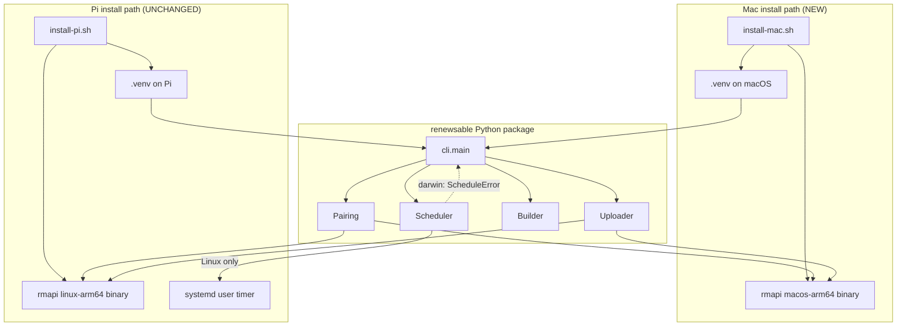

# Design Document — mac-manual-mode

## Overview

**Purpose**: Add a parallel install path so a macOS Apple Silicon workstation can run the existing renewsable build-and-upload pipeline on demand, without standing up a Raspberry Pi. The Pi path with its `systemd --user` timer remains the supported production path; this spec deliberately does not bring scheduling to macOS.

**Users**: A renewsable operator who already owns a Mac and prefers running the daily digest themselves over provisioning a Pi.

**Impact**: Adds one new bash bootstrap script (`scripts/install-mac.sh`), one platform-refusal seam inside the existing `Scheduler`, and one new README section parallel to the existing Pi runbook. The build, upload, pairing, config, logging, and paths components are already cross-platform and are reused without modification.

### Goals

- A one-command `scripts/install-mac.sh` brings a clean Apple Silicon Mac to the point where `renewsable pair`, `renewsable test-pipeline`, and `renewsable run` succeed end-to-end.
- `renewsable install-schedule` and `renewsable uninstall-schedule` fail fast on macOS with a message that names the manual entrypoints (`renewsable run`, `renewsable test-pipeline`) and never invoke a host scheduler.
- The Pi install path and Linux scheduler behavior are unchanged. Existing tests pass without modification.

### Non-Goals

- Any scheduled execution on macOS (`launchd`, `cron`, or any other host scheduler).
- Intel Mac (`darwin/x86_64`) support. Restricted to Apple Silicon to avoid pinning a second `rmapi` artefact.
- Changes to `Builder`, `Uploader`, `Pairing`, `Config`, `Articles`, `EPUB`, `HTTP`, or `Logging`.
- A `MAC_VERIFICATION.md` analogue to `PI_VERIFICATION.md` (deferred; the README walkthrough is sufficient).
- Any restructuring of the existing Pi runbook beyond a one-paragraph disambiguator at the top of the setup section.

## Boundary Commitments

### This Spec Owns

- The macOS bootstrap script (`scripts/install-mac.sh`): host detection, Python-version check, project-local venv, editable install, pinned `rmapi-macos-arm64.zip` download, SHA-256 verification, extraction, idempotency.
- The macOS-refusal seam inside `Scheduler.install()` / `Scheduler.uninstall()`: detect `sys.platform == "darwin"` and raise `ScheduleError` with operator-actionable remediation copy that names `renewsable run` and `renewsable test-pipeline`.
- The README "Setup on macOS (manual mode)" section and the one-paragraph disambiguator that precedes the existing Pi runbook.
- The `scripts/README.md` paragraph documenting the macOS rmapi pin and bump procedure (parallel to the existing Pi paragraph).

### Out of Boundary

- Any changes to `scripts/install-pi.sh` beyond a one-line cross-reference comment pointing maintainers at the macOS pin.
- The Linux `Scheduler` happy path (template rendering, `systemctl --user` invocation, unit-file install/uninstall, status reporting). It continues to behave exactly as defined by `daily-paper`.
- The `Pairing` flow. It is already cross-platform and is consumed unchanged on macOS via the existing `~/.config/rmapi/rmapi.conf` token discipline.
- Any change to the configuration schema, output filename convention, EPUB build, RSS extraction, or upload behavior.
- Test infrastructure changes (markers, conftest, CI matrix). Existing `pytest` already runs on macOS because all subprocess seams are mocked.

### Allowed Dependencies

- The macOS bootstrap script may depend on tools that ship in macOS by default: `python3` (≥ 3.11; verified at script entry), `curl`, `unzip`, `shasum`, `install`, `mktemp`. It must not assume Homebrew, GNU coreutils, `wget`, or `tar`-extraction of `.zip`.
- The `Scheduler` refusal may depend on `sys.platform` from the Python standard library, exposed through a module-level alias (`scheduler.sys`) so existing tests can monkeypatch it consistently with the existing `scheduler.subprocess` boundary.
- `scripts/install-mac.sh` may invoke `pip install -e ".[dev]"` against `pyproject.toml` exactly as `install-pi.sh` does today.

### Revalidation Triggers

The following changes in upstream specs or shared infrastructure would force this spec's consumers to re-check:

- A change to `pyproject.toml`'s `requires-python` floor — the macOS script's Python-version check is pinned to `>=3.11` and must move in lockstep.
- A change to the `rmapi` pin in `scripts/install-pi.sh` — the macOS pin should bump in lockstep so a Pi/Mac mixed deployment shares one rmapi version.
- A change to the `Scheduler.install()` / `Scheduler.uninstall()` public signatures or to the `ScheduleError` envelope. The platform refusal raises `ScheduleError`; downstream consumers (CLI exit-code translation) read its message and remediation.
- A new `renewsable` subcommand that requires a host scheduler on Linux. It must opt into the same macOS-refusal pattern explicitly; this spec does not provide a generic decorator.

## Architecture

### Existing Architecture Analysis

Renewsable today is a single-process Python orchestrator with a small set of components, each consumed via a thin CLI wrapper:

- **CLI** (`cli.py`): Click group; each subcommand loads `Config`, configures logging, instantiates one component, and translates `RenewsableError` to exit codes.
- **Scheduler** (`scheduler.py`): Renders `renewsable.service` / `renewsable.timer` from string templates and drives `systemctl --user` through a module-level `subprocess` alias kept exposed for test monkey-patching.
- **Pairing**, **Builder**, **Uploader**, **Config**, **Articles**, **HTTP**, **EPUB**, **Logging**, **Paths**: pure Python, OS-agnostic, already exercised on macOS during development (the test suite mocks all subprocess seams).
- **Pi bootstrap** (`scripts/install-pi.sh`): host check (Linux + aarch64), apt prereqs, venv, editable install, pinned `rmapi-linux-arm64.tar.gz` download with SHA-256 verification, smoke test.

The existing module-level subprocess-alias seam (`scheduler.subprocess`, `pairing.subprocess`, `uploader.subprocess`) is the project's standard for testability. This spec extends the same pattern by exposing a `sys` alias on `scheduler.py` so platform branches can be monkey-patched the same way subprocess calls are.

### Architecture Pattern & Boundary Map



**Key decisions**

- **The platform refusal lives in `Scheduler`, not in `cli.py`.** The scheduler is the component that already owns the "given a host, install/uninstall a timer" contract; refusing on hosts where renewsable does not own a timer system is the same contract. Consequence: the CLI stays trivial and the existing `RenewsableError → exit 1` translation in `cli.py` carries the refusal message to stderr without any new branching.
- **One bootstrap per platform, no shared bash library.** `scripts/install-mac.sh` is a sibling of `scripts/install-pi.sh`. The duplicated portions (venv + editable install + smoke test) are roughly 30 lines and read better inline than via a sourced common file. A two-line cross-reference comment in each script reminds the maintainer to bump rmapi pins together.
- **macOS asset is `rmapi-macos-arm64.zip`, extracted with `unzip`.** The `ddvk/rmapi` upstream names the macOS asset with a `macos` (not `darwin`) prefix and ships it as a zip. The script uses macOS-shipped `unzip` and `shasum -a 256 -c` (BSD coreutils) — no Homebrew dependency.

### Technology Stack

| Layer | Choice / Version | Role in Feature | Notes |
|-------|------------------|-----------------|-------|
| Bootstrap shell | `bash` (set -euo pipefail) | Idempotent host setup on macOS | Mirrors `install-pi.sh` style. macOS ships `bash 3.2`; script must avoid bash-4 features (associative arrays, `${var^^}`, etc.). |
| Host platform | macOS, Apple Silicon (`uname -s == Darwin`, `uname -m == arm64`) | Target environment | Intel Macs explicitly rejected with a guidance message. |
| Python runtime | `python3` ≥ 3.11 (whatever the operator has on PATH) | Driving the renewsable CLI | Verified by `python3 -c "import sys; sys.exit(0 if sys.version_info >= (3, 11) else 1)"`. Homebrew `python@3.11` or newer is the recommended source. |
| Archive format | `unzip` (macOS-shipped at `/usr/bin/unzip`) | Extracts `rmapi-macos-arm64.zip` | Replaces the `tar -xzf` path used by `install-pi.sh`. |
| Hash tool | `shasum -a 256 -c` (macOS-shipped) | Verifies pinned rmapi archive | Replaces `sha256sum --check --status`. The output formats are compatible enough for `-c` mode. |
| External binary | `ddvk/rmapi v0.0.32` (`rmapi-macos-arm64.zip`) | reMarkable cloud client used by `Pairing` and `Uploader` | Pinned in lockstep with the `install-pi.sh` Linux pin. SHA-256 embedded as a constant; computed once at script-write time via `shasum -a 256 rmapi-macos-arm64.zip`. |
| Scheduler stdlib | `sys.platform` from the Python standard library | Detects Darwin in `Scheduler.install()` / `Scheduler.uninstall()` | Exposed as `scheduler.sys` for symmetry with the existing `scheduler.subprocess` test seam. |

## File Structure Plan

### New Files

```
scripts/
└── install-mac.sh                # macOS Apple Silicon bootstrap (parallel to install-pi.sh)
```

### Modified Files

- `src/renewsable/scheduler.py` — Add a module-level `sys` alias and an `_assert_supported_platform()` helper called at the top of `install()` and `uninstall()`. No change to template rendering, `_run_systemctl()`, `status()`, or `_is_missing_unit_error()`.
- `tests/test_scheduler.py` — Add two test cases: `test_install_refuses_on_darwin` and `test_uninstall_refuses_on_darwin`, both monkey-patching `scheduler.sys.platform` to `"darwin"` and asserting (a) `ScheduleError` is raised, (b) the message names `renewsable run` and `renewsable test-pipeline`, (c) the fake `subprocess.run` is never invoked. No changes to existing test cases.
- `README.md` — Add a one-paragraph disambiguator above the existing "Setup on the Pi (one-time)" section noting the two install paths. Append a sibling "Setup on macOS (manual mode)" section after the Pi section, with steps in this order: bootstrap → pair → test-pipeline → run. Add an explicit "scheduling is not supported on macOS — invoke `renewsable run` yourself" callout.
- `scripts/README.md` — Add a paragraph parallel to the existing Pi paragraph that documents the macOS rmapi pin (`v0.0.32`, `rmapi-macos-arm64.zip`, embedded SHA-256), the bump procedure (`shasum -a 256 rmapi-macos-arm64.zip`), and a cross-reference reminder to keep Pi/Mac pins in lockstep.
- `scripts/install-pi.sh` — Add a one-line comment near the `RMAPI_VERSION` block pointing maintainers at `scripts/install-mac.sh` for the corresponding macOS pin. No behavior change.

> **Boundary alignment**: the file list reflects exactly the surface this spec owns. No edits to `cli.py`, `pairing.py`, `uploader.py`, `builder.py`, `config.py`, `articles.py`, `epub.py`, `http.py`, `logging_setup.py`, `paths.py`, `errors.py`, or `pyproject.toml`. No edits to `Dockerfile`. The disclaimer in the existing scheduler tests (lines 14–18) stays accurate: `systemctl` still does not exist on macOS; the new behavior is precisely about refusing rather than calling it.

## Components and Interfaces

| Component | Domain / Layer | Intent | Req Coverage | Key Dependencies (P0/P1) | Contracts |
|-----------|----------------|--------|--------------|--------------------------|-----------|
| `install-mac.sh` | Bootstrap (shell) | Bring a clean Apple Silicon Mac to a runnable renewsable install | 1.1, 1.2, 1.3, 1.4, 1.5, 1.6 | `python3 ≥ 3.11` (P0), `curl` (P0), `unzip` (P0), `shasum` (P0), pinned `rmapi-macos-arm64.zip` (P0) | Batch / Job |
| `Scheduler` (extended) | Scheduling | Refuse `install` / `uninstall` on macOS; behave unchanged on Linux | 2.1, 2.2, 2.3, 2.4, 5.2, 5.3 | `sys.platform` (P0), `subprocess` (P0, Linux only) | Service |
| README "macOS (manual mode)" section | Documentation | Walk a macOS operator through bootstrap → pair → test-pipeline → run | 4.1, 4.2, 4.3, 4.4 | Existing Pi runbook structure (P1) | — |
| `scripts/README.md` macOS pin paragraph | Documentation | Document the macOS rmapi pin and bump procedure | 1.2, 1.3 | Existing Pi pin paragraph (P1) | — |

### Bootstrap

#### `install-mac.sh`

| Field | Detail |
|-------|--------|
| Intent | Idempotent macOS Apple Silicon bootstrap parallel to `install-pi.sh` |
| Requirements | 1.1, 1.2, 1.3, 1.4, 1.5, 1.6 |

**Responsibilities & Constraints**

- Execute exclusively on `Darwin` + `arm64`. On any other host (Linux, Darwin/x86_64, Darwin without arm64), exit non-zero with a message that names the detected platform and explicitly states only Apple Silicon macOS is supported.
- Verify `python3 --version` ≥ 3.11; if not, exit non-zero with a message recommending `brew install python@3.12` (or higher) and re-run.
- Create a project-local `.venv/` if absent; reuse if present (idempotency).
- Run `pip install --upgrade pip` followed by `pip install -e ".[dev]"` inside the venv.
- Download `rmapi-macos-arm64.zip` for the pinned `RMAPI_VERSION` (`v0.0.32`) from the `ddvk/rmapi` GitHub releases. Verify against the embedded `RMAPI_SHA256` constant via `shasum -a 256 -c`. On mismatch, exit non-zero without writing the binary; the message must name the expected checksum and the offending archive filename.
- Extract the verified zip with `unzip -q`. Install the resulting `rmapi` executable into `.venv/bin/rmapi` with `install -m 0755`.
- After installing the binary, defensively clear macOS quarantine metadata: `xattr -d com.apple.quarantine "$RMAPI_BIN" 2>/dev/null || true`. `curl` typically does not set the quarantine xattr, so this is a no-op in the common path; the explicit clear-then-ignore-failure pattern makes the script robust if the binary is ever sourced via a browser download or another quarantine-setting path. Without this step, an unsigned/unnotarized `rmapi` invocation can fail at first `renewsable pair` with a Gatekeeper rejection.
- If `.venv/bin/rmapi` already exists and is executable, skip the download/verify/extract block (idempotency). The quarantine-clear is also re-run in this branch (cheap and idempotent).
- Smoke-test the install: `.venv/bin/renewsable --help` must exit 0; `.venv/bin/rmapi version` is run with output discarded; a non-zero exit is downgraded to a warning (mirrors `install-pi.sh`). A Gatekeeper rejection at this step is the early-warning signal that the quarantine-clear did not take effect.
- Print the manual next-steps banner: `pair`, `test-pipeline`, `run`. Explicitly note that no scheduler is installed.
- Must not invoke `apt-get`, `sudo`, `brew`, or any package manager. The script reads from `pyproject.toml` and writes only to `.venv/` and a temp directory under `mktemp`.

**Dependencies**

- Inbound: invoked by the operator from the project root (Outbound from operator's shell). (P0)
- Outbound (build-time): `pip install -e ".[dev]"` against `pyproject.toml`. (P0)
- External: `curl`, `unzip`, `shasum`, `install`, `mktemp`, `python3`, `xattr`. (P0, all macOS-shipped.)
- External: GitHub releases asset `rmapi-macos-arm64.zip`@`v0.0.32`. (P0, pinned with SHA-256; unsigned/unnotarized for macOS — quarantine xattr cleared defensively after install.)

**Contracts**: Service [ ] / API [ ] / Event [ ] / Batch [x] / State [ ]

##### Batch / Job Contract

- **Trigger**: Operator runs `./scripts/install-mac.sh` from the project root.
- **Input / validation**: Working directory must contain `pyproject.toml` and `src/renewsable/`. Host must be `Darwin` + `arm64`. `python3` must be ≥ 3.11 and on `PATH`.
- **Output / destination**: Project-local `.venv/` populated; `.venv/bin/rmapi` and `.venv/bin/renewsable` executable; on success a green banner prints next steps to stdout.
- **Idempotency & recovery**: Re-running on a fully bootstrapped host completes successfully without redownloading the rmapi archive or recreating the venv. Any failure (host check, Python version, SHA mismatch, network failure) exits non-zero before mutating the venv or `.venv/bin/rmapi`.

**Implementation Notes**

- Integration: Mirror `install-pi.sh`'s structure (Pinned versions → Helpers → Sanity → Prereq commands → Apt block REPLACED by Python check → Venv → Editable install → rmapi download/verify/extract → Smoke test → Banner). Keep banner copy short; the README is the runbook.
- Validation: Embedded SHA-256 constant for `rmapi-macos-arm64.zip` v0.0.32; bump procedure documented in `scripts/README.md`.
- Risks: macOS `bash 3.2` lacks bash-4 features. Use only POSIX-friendly constructs already used by `install-pi.sh` (case statements, `[ ... ]`, `printf`, `die`/`warn`/`log` helpers).

### Scheduling

#### `Scheduler` (extended)

| Field | Detail |
|-------|--------|
| Intent | On Linux, behave exactly as today. On macOS, refuse `install` / `uninstall` with operator-actionable error. |
| Requirements | 2.1, 2.2, 2.3, 2.4, 5.2, 5.3 |

**Responsibilities & Constraints**

- The `install()`, `uninstall()`, AND `status()` methods MUST call `_assert_supported_platform()` as their first executable statement. The helper raises `ScheduleError` when `sys.platform == "darwin"`, with `remediation` text that names `renewsable run` and `renewsable test-pipeline` as the manual entrypoints. Symmetric refusal across all three methods avoids a latent `FileNotFoundError` if `status()` is ever wired to a CLI subcommand: `subprocess.run(["systemctl", ...])` on a host without `systemctl` raises before any returncode is set, so the existing returncode-based fallback in `status()` does NOT degrade gracefully on macOS.
- Platform detection reads `sys.platform` via the new module-level `sys` alias. Tests monkey-patch `scheduler.sys.platform = "darwin"` exactly as they monkey-patch `scheduler.subprocess.run` today.
- On Linux (`sys.platform == "linux"` or any non-`"darwin"` value), the behavior is bit-identical to the pre-spec implementation. No new branches in the Linux happy path.

**Dependencies**

- Inbound: `cli.install_schedule`, `cli.uninstall_schedule`. (P0)
- Outbound: `subprocess.run` for `systemctl` (Linux only). (P0 on Linux, unused on Darwin.)
- External: `sys.platform` from the Python standard library. (P0)

**Contracts**: Service [x] / API [ ] / Event [ ] / Batch [ ] / State [ ]

##### Service Interface

```python
import sys  # module-level alias, monkey-patched in tests

class Scheduler:
    def install(self) -> None:
        """Install the systemd user timer.

        Raises:
            ScheduleError: if running on macOS (Req 2.1, 2.3) or if any
                downstream systemctl call fails on Linux (existing behavior).
        """
        ...

    def uninstall(self) -> None:
        """Disable, stop, and remove the systemd user timer.

        Raises:
            ScheduleError: if running on macOS (Req 2.2, 2.3) or if a
                non-"missing unit" systemctl failure occurs on Linux.
        """
        ...

    def status(self) -> str:
        """Return a short string describing the timer state on Linux.

        Raises:
            ScheduleError: if running on macOS (defensive symmetry with
                install/uninstall: `systemctl` is absent on macOS and would
                raise FileNotFoundError before status's existing returncode
                fallback could engage).
        """
        ...

    @staticmethod
    def _assert_supported_platform() -> None:
        """Raise ScheduleError on macOS with operator-actionable remediation.

        Reads sys.platform via the module-level alias.
        """
        ...
```

- **Preconditions**: The caller has constructed a `Scheduler(config, exe_path)` instance (no platform check at construction time — the check is per-method so that future `status()`-only consumers stay supported).
- **Postconditions**: On macOS, `install()` and `uninstall()` raise `ScheduleError` and have not invoked `subprocess.run` and have not written or deleted any unit files. On Linux, behavior matches `daily-paper`.
- **Invariants**: `_assert_supported_platform()` reads `sys.platform` exactly once per call; the platform decision never partially commits a unit file write.

**Implementation Notes**

- Integration: Add `import sys` at module top; this becomes the test seam (`scheduler.sys.platform`). The error message format follows the existing `ScheduleError(message, remediation=...)` pattern used elsewhere in `scheduler.py`.
- Validation: Two new unit tests in `tests/test_scheduler.py` (described in Testing Strategy). Existing tests are not modified.
- Risks: None material. The `sys.platform` value is stable across Python versions on macOS (`"darwin"` since Python 2.5).

### Documentation

#### README "macOS (manual mode)" section

| Field | Detail |
|-------|--------|
| Intent | Give Mac operators a clean walkthrough alongside the existing Pi runbook |
| Requirements | 4.1, 4.2, 4.3, 4.4 |

**Responsibilities & Constraints**

- New section sits *after* the existing "Setup on the Pi (one-time)" section, preserving the Pi runbook's step ordering and prose untouched.
- A one-paragraph disambiguator at the top of the setup region (above the Pi section) introduces the two paths and recommends Pi for "wakes up to a fresh paper" semantics, Mac for "I run it when I want it" semantics.
- The macOS section walks the operator through, in order: (1) `./scripts/install-mac.sh`, (2) `renewsable pair`, (3) `renewsable --config config/config.example.json test-pipeline`, (4) `renewsable run` for daily use, with a short note on creating a personal `~/.config/renewsable/config.json`.
- An explicit callout block states that `install-schedule` and `uninstall-schedule` exit non-zero on macOS by design, that no `launchd` / `cron` integration is provided, and that the operator must invoke `renewsable run` themselves.

**Implementation Notes**

- Integration: Use the same fenced `bash` code-block style as the existing Pi runbook. Re-use the existing "Customise the config" block by reference rather than restating it.
- Risks: README drift if the Pi section is later renamed. Cross-reference is text-only; no anchor links to break.

#### `scripts/README.md` macOS pin paragraph

| Field | Detail |
|-------|--------|
| Intent | Document the macOS rmapi pin and bump procedure parallel to the existing Pi paragraph |
| Requirements | 1.2, 1.3 |

**Responsibilities & Constraints**

- Document the pinned `RMAPI_VERSION`, the asset filename `rmapi-macos-arm64.zip`, and the bump procedure (`shasum -a 256 rmapi-macos-arm64.zip`).
- State explicitly that the Pi and Mac pins should bump together; reference the cross-script comment.
- Note that `rmapi` is unsigned/unnotarized for macOS and that the install script defensively runs `xattr -d com.apple.quarantine` after placing the binary. If a maintainer ever moves the install path or replaces `curl` with another download tool, the quarantine-clear step must continue to run.

## Requirements Traceability

| Requirement | Summary | Components | Interfaces | Flows |
|-------------|---------|------------|------------|-------|
| 1.1 | Create venv + editable install on Darwin/arm64 | `install-mac.sh` | Batch / Job | Bootstrap |
| 1.2 | Pinned `rmapi-macos-arm64.zip` download with SHA-256 verify | `install-mac.sh`, `scripts/README.md` | Batch / Job | Bootstrap |
| 1.3 | SHA-256 mismatch aborts without installing the binary | `install-mac.sh`, `scripts/README.md` | Batch / Job | Bootstrap |
| 1.4 | Reject non-Darwin/arm64 hosts | `install-mac.sh` | Batch / Job (validation) | Bootstrap |
| 1.5 | Idempotent re-runs | `install-mac.sh` | Batch / Job | Bootstrap |
| 1.6 | No `apt-get` / `sudo` | `install-mac.sh` | Batch / Job | Bootstrap |
| 2.1 | `install-schedule` exits non-zero on macOS, names manual entrypoints | `Scheduler._assert_supported_platform`, `Scheduler.install` | Service | — |
| 2.2 | `uninstall-schedule` exits non-zero on macOS, names manual entrypoints | `Scheduler._assert_supported_platform`, `Scheduler.uninstall` | Service | — |
| 2.3 | No `systemctl` / `launchctl` / `crontab` invocation on macOS | `Scheduler.install`, `Scheduler.uninstall` (refusal precedes any subprocess) | Service | — |
| 2.4 | Linux scheduler behavior unchanged | `Scheduler.install`, `Scheduler.uninstall` (no branch on non-darwin path) | Service | — |
| 3.1 | `renewsable pair` works on macOS | (Existing `Pairing`; verified by README walkthrough and manual end-to-end run) | — | — |
| 3.2 | `build` / `upload` / `run` / `test-pipeline` produce parity output on macOS | (Existing `Builder`, `Uploader`, `cli.run`, `cli.test_pipeline`; verified by manual end-to-end run) | — | — |
| 3.3 | No systemd dependency in pipeline commands | (Existing `Builder` / `Uploader` / `Pairing` / `cli.build` / `cli.upload` / `cli.run` / `cli.test_pipeline` already make no systemd calls; verified by inspection.) | — | — |
| 4.1 | README has macOS sibling section | README "macOS (manual mode)" section | — | — |
| 4.2 | macOS section walks bootstrap → pair → test-pipeline → run | README "macOS (manual mode)" section | — | — |
| 4.3 | macOS section explicitly disclaims scheduling | README "macOS (manual mode)" section | — | — |
| 4.4 | Existing Pi runbook structure preserved | README disambiguator paragraph (Pi section body untouched) | — | — |
| 5.1 | Pi bootstrap continues to install on Pi OS Bookworm 64-bit | (Existing `install-pi.sh`; only edit is a one-line cross-reference comment with no behavior change) | — | — |
| 5.2 | `install-schedule` on Linux installs the systemd timer | `Scheduler.install` (Linux happy path unchanged) | Service | — |
| 5.3 | `uninstall-schedule` on Linux removes the systemd timer | `Scheduler.uninstall` (Linux happy path unchanged) | Service | — |
| 5.4 | Linux pipeline commands behave per existing specs | (No edits to `cli.build`, `cli.upload`, `cli.run`, `cli.pair`, `cli.test_pipeline`, `Builder`, `Uploader`, `Pairing`; verified by existing test suite passing.) | — | — |

## Error Handling

### Error Strategy

The feature introduces no new error envelopes. It re-uses the existing `RenewsableError` hierarchy and the CLI's existing exit-code translation:

- `ScheduleError` (existing) — raised by `Scheduler._assert_supported_platform()` when on macOS. Carries a `remediation=` string naming `renewsable run` and `renewsable test-pipeline`. The CLI translates any `RenewsableError` other than `ConfigError` to exit code 1 with the message on stderr (`cli.py:188-190`). No CLI changes required.
- Bootstrap script errors (host mismatch, Python version, SHA-256 mismatch, network failure, missing tool) — exit non-zero with a `[install-mac error]` prefixed message via the existing `die()` helper pattern. The script must abort *before* mutating `.venv/`, `.venv/bin/rmapi`, or any system state.

### Error Categories and Responses

- **Host mismatch (1.4)**: Bootstrap script exits 1 with `[install-mac error] this script targets Apple Silicon macOS; detected: <kernel> / <arch>`.
- **Python version too old (1.1, 1.2 prereq)**: Bootstrap script exits 1 with a message recommending `brew install python@3.12` or higher and re-running.
- **SHA-256 mismatch (1.3)**: Bootstrap script exits 1, names the expected checksum and the offending archive, recommends verifying the upstream release before bumping the embedded SHA constant.
- **Network failure during `curl`**: `set -e` plus `curl --fail --silent --show-error --location` cause a non-zero exit with curl's own stderr bubbled up.
- **Scheduler refusal on macOS (2.1, 2.2)**: `ScheduleError(message="renewsable does not support scheduled execution on macOS", remediation="run `renewsable run` or `renewsable test-pipeline` manually when you want a digest")`. CLI prints to stderr; exit 1.

### Monitoring

No new monitoring surface. The existing logging discipline (rotating plain-text log under `~/.local/state/renewsable/logs/`, journald on Pi) continues to apply. The bootstrap script writes only to stdout/stderr.

## Testing Strategy

### Unit Tests (new)

Two new test cases in `tests/test_scheduler.py`. Both use the existing `_make_config` helper and a `FakeSubprocess` that records calls.

1. **`test_install_refuses_on_darwin`** — Construct a `Scheduler`, monkey-patch `sched_mod.sys.platform = "darwin"` and `sched_mod.subprocess.run = FakeSubprocess()`. Assert `Scheduler.install()` raises `ScheduleError`, the message names `renewsable run` and `renewsable test-pipeline`, no unit files are written, and `FakeSubprocess.calls` is empty. Covers Req 2.1, 2.3.
2. **`test_uninstall_refuses_on_darwin`** — Same setup with `Scheduler.uninstall()`. Assert `ScheduleError` raised; no unit files deleted; no `subprocess.run` calls. Covers Req 2.2, 2.3.

### Integration Tests (existing, must continue to pass)

3. **All existing tests in `tests/test_scheduler.py`** (already passing on macOS via `subprocess.run` mocking) — must continue to pass after the new `_assert_supported_platform()` helper is added to `install()`, `uninstall()`, AND `status()`. Because `_assert_supported_platform()` reads `sys.platform` and the dev box reports `"darwin"`, every test that exercises any of those three methods would short-circuit without an explicit override. The implementation MUST add a pytest **autouse** fixture in `tests/test_scheduler.py` that sets `sched_mod.sys.platform = "linux"` before each test runs. The two new "refuses on darwin" tests (Unit Tests above) override the autouse fixture by setting `sched_mod.sys.platform = "darwin"` inline. This is a single canonical seam — do not pursue the alternative of patching every test individually.
4. **`tests/test_cli.py:test_install_schedule_failure`** (existing line 454) — already asserts that a `ScheduleError("systemctl failed")` from `Scheduler` becomes a non-zero CLI exit with the message on stderr. The new macOS-refusal `ScheduleError` rides the same path; no CLI test changes needed, though an optional new test case `test_install_schedule_on_darwin` would mirror it for completeness.

### E2E (manual, on real hardware)

5. **Mac bootstrap walk** — On a clean Apple Silicon Mac with `python@3.11+` installed via Homebrew, run `./scripts/install-mac.sh`, then `renewsable pair`, then `renewsable --config config/config.example.json test-pipeline`. Verify a dated EPUB lands in `~/.local/state/renewsable/out/` and in `/News/` on the reMarkable. Verify `renewsable install-schedule` exits 1 with the expected message. Verify `./scripts/install-mac.sh` is idempotent (re-run completes without re-downloading).
6. **Pi non-regression** — On the existing Pi deployment, `git pull`, `pip install -e .`, `renewsable install-schedule`. Verify the timer still fires and the daily build still runs. (Optional but recommended given Req 5.)

### Performance / Load

Not applicable.
