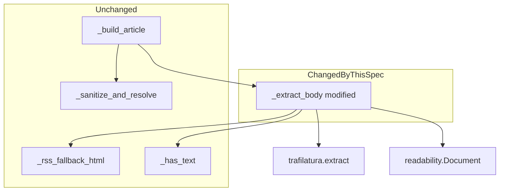
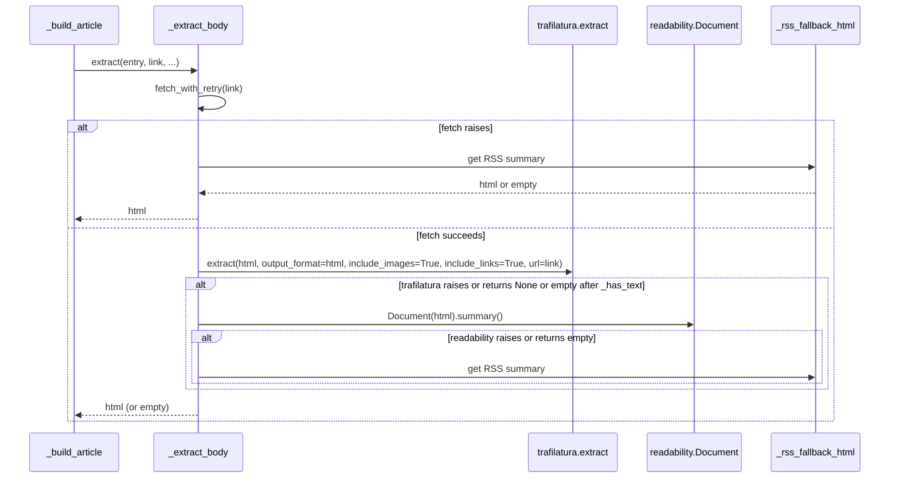

# Design Document — `trafilatura-extractor`

## Overview

**Purpose**: Replace `readability-lxml` with `trafilatura` as the primary article-content extractor inside `articles._extract_body`, keeping `readability-lxml` as a secondary fallback and the RSS summary as the final fallback. Closes the BBC News one-paragraph stub bug ([GH #8](https://github.com/kbence/renewsable/issues/8)) by giving the pipeline an extractor that handles Next.js / React server-rendered pages correctly.

**Users**: The single operator running renewsable on a Raspberry Pi via the daily systemd timer. Downstream readers consume the EPUB on a reMarkable.

**Impact**: Adds one runtime dependency (`trafilatura>=2.0.0,<3`); modifies one function (`articles._extract_body`); leaves every other module, contract, and pipeline stage untouched. Operators must run `pip install -e .` after pulling for the new dep to land in the venv.

### Goals
- Trafilatura is the first extractor consulted on every article fetch.
- A non-empty post-`_has_text` check on the trafilatura output short-circuits all other extractors.
- Trafilatura exceptions or empty output cleanly fall through to readability, then to the RSS summary, exactly as today.
- BBC News chapters in the produced EPUB contain multi-paragraph content rather than a one-paragraph stub.

### Non-Goals
- Removing `readability-lxml` from the project. It stays as the secondary fallback.
- Switching the RSS parser, the EPUB assembler, the image embedder, or any other stage.
- Per-site bespoke extractors or feed-specific configuration.
- A user-configurable extractor selector.

## Boundary Commitments

### This Spec Owns
- The function body of `articles._extract_body`.
- The new `trafilatura` runtime dependency in `pyproject.toml`.
- Tests that lock in the new fallback chain and the BBC-shaped multi-paragraph extraction outcome.

### Out of Boundary
- Every other function in `articles.py` (`collect`, `_build_article`, `_rss_fallback_html`, `_sanitize_and_resolve`, `_resolve_url`, `_has_text`).
- Every other module: `builder`, `epub`, `http`, `config`, `cli`, `uploader`, `errors`, `paths`, `scheduler`, `pairing`, `logging_setup`.
- The `Article` dataclass shape and contract.
- The CLI surface, the EPUB assembly pipeline, the upload path.

### Allowed Dependencies
- `trafilatura>=2.0.0,<3` (new runtime dep; Apache 2.0 license; pure-Python with `lxml>=5.3` already in the dependency tree).
- `readability-lxml==0.8.1` (existing pin retained for the fallback path).
- `feedparser`, `lxml`, `lxml_html_clean` (existing).
- Stdlib only beyond the above.

### Revalidation Triggers
- Any change to `Article.html` shape coming out of `_extract_body` would force the EPUB assembler tests to re-validate (they currently consume `Article.html` and rely on absolute http(s) URLs and the legacy-attr strip — these invariants must continue to hold).
- Adding a third extractor or reordering the chain would require updating the tests that lock the order.
- Removing `readability-lxml` would make Req 2 unimplementable; treat it as a separate spec if ever proposed.

## Architecture

### Existing Architecture Analysis

`articles.py` already has the pipeline shape this design targets: `_build_article` wraps `_extract_body` in a try/except so per-entry failures never raise; `_extract_body` calls a single extractor today and falls back to the RSS summary on failure or empty output. `_sanitize_and_resolve` runs *after* `_extract_body` and enforces every output invariant (absolute URLs, scheme allowlist, legacy-attribute strip). The change is therefore strictly additive at one call site — every downstream guarantee is provided by code we are not touching.

### Architecture Pattern & Boundary Map



**Selected pattern**: ordered fallback chain inside a single function. trafilatura → readability → RSS summary.

**Dependency direction (preserved)**: `articles` continues to import from `http` and from third-party libs (`feedparser`, `lxml`, `readability`, and now `trafilatura`). It does not import from `builder`, `epub`, `cli`, or any other internal module.

### Technology Stack

| Layer | Choice / Version | Role | Notes |
|---|---|---|---|
| Article extraction | `trafilatura>=2.0.0,<3` (new) | Primary article-body extractor | Apache 2.0; returns `None` on failure (no exception path); uses `lxml>=5.3` already in tree |
| Article extraction (fallback) | `readability-lxml==0.8.1` (existing pin) | Secondary fallback when trafilatura yields nothing | Pinned for the encoding-regression reason already documented |
| HTML walking / sanitization | `lxml`, `lxml_html_clean` (existing) | Cleaner + URL resolution + legacy-attr strip | Unchanged |
| RSS parsing | `feedparser>=6.0` (existing) | Feed-level parsing | Unchanged |

## File Structure Plan

### Modified Files
- `src/renewsable/articles.py` — Add `import trafilatura` at module scope (test seam). Modify `_extract_body` to call `trafilatura.extract` first, then fall through to the existing readability path on `None`/empty/exception, then to `_rss_fallback_html`. Update the function's docstring to reflect the new chain.
- `tests/test_articles.py` — Rename `test_happy_path_extracts_readability_body` → `test_happy_path_extracts_via_trafilatura`. Add `test_falls_back_to_readability_when_trafilatura_returns_none`. Add `test_falls_back_to_readability_when_trafilatura_raises`. Add `test_bbc_style_nextjs_html_extracts_multi_paragraph_body` with an inline canned Next.js-shaped fixture. Existing tests that rely on real extractor behavior on simple `<article><p>…</p>` HTML continue to pass — trafilatura handles those identically.
- `pyproject.toml` — Add `trafilatura>=2.0.0,<3` to runtime `dependencies`. Bump the package's user-agent comment block isn't required (UA already correct).

### Unchanged
Every other source file and test file. The dependency direction graph, the EPUB pipeline, the CLI, and the existing `_sanitize_and_resolve` invariants are all preserved without coordinated changes.

## System Flows



**Key decisions**:
- **Order**: trafilatura → readability → RSS. Locked by Req 1, 2, 3.
- **"Usable content" definition**: identical for both extractors — the existing `_has_text` helper. A single source of truth keeps the contract simple and prevents the original bug class (a non-empty stub being accepted as a successful extraction is mitigated by the better extractor; "non-empty after `_has_text`" remains the threshold).
- **Trafilatura call signature**: `trafilatura.extract(html_text, output_format='html', include_images=True, include_links=True, url=link)`. Locked by Req 1.3 (preserve images and inline links). The `url=link` kwarg is defense-in-depth for relative-URL resolution; the existing urljoin pass in `_sanitize_and_resolve` runs afterwards regardless.
- **No `fast=True`**: accuracy matters more than the sub-second saving across a daily build of ~30 articles.
- **Trafilatura exceptions caught**: trafilatura returns `None` on failure rather than raising, but we still wrap the call in try/except for defense-in-depth. This satisfies Req 2.1 unambiguously.

## Requirements Traceability

| Requirement | Summary | Components | Interfaces | Flows |
|---|---|---|---|---|
| 1.1 | Trafilatura called first | `_extract_body` | First branch in the chain | Sequence: `Trafilatura` step |
| 1.2 | Non-empty trafilatura output short-circuits | `_extract_body` + `_has_text` | Early return after `_has_text(body)` | Sequence: alt branch closure |
| 1.3 | Preserve images and links | `_extract_body` | `include_images=True, include_links=True, output_format='html'` | n/a |
| 2.1 | Trafilatura raises → readability fallback | `_extract_body` | try/except wraps the trafilatura call | Sequence: alt "raises or returns None" |
| 2.2 | Trafilatura empty → readability fallback | `_extract_body` + `_has_text` | `_has_text(body)` check | Sequence: same alt |
| 2.3 | Readability non-empty accepted | `_extract_body` | Existing `Document(...).summary()` + `_has_text` | Sequence: readability branch return |
| 3.1 | RSS-summary fallback when both fail | `_rss_fallback_html` (unchanged) | Existing call | Sequence: RssFallback step |
| 3.2 | Drop entry when all three fail | `_build_article` (unchanged) | Existing empty-html drop | n/a |
| 4.1 | BBC full multi-paragraph output | `_extract_body` (via trafilatura) | trafilatura's heuristic | Sequence: trafilatura branch |
| 4.2 | Per-entry resilience on BBC entries | `_build_article` (unchanged) | Existing try/except | n/a |
| 5.1 | Non-regression on working sources | `_extract_body` | Same call shape on all sources | n/a |
| 5.2 | Article.html invariants preserved | `_sanitize_and_resolve` (unchanged) | Existing pipeline | n/a |
| 6.1 | No raise out of `collect` | `_build_article` (unchanged) + `_extract_body` try/except | Existing wrap | n/a |
| 6.2 | Per-entry WARNING log on failure | `_build_article` (unchanged) | Existing logger calls | n/a |
| 7.1 | Absolute http(s) URLs only | `_sanitize_and_resolve` (unchanged) | Existing urljoin pass | n/a |
| 7.2 | Drop `data:`/`javascript:` URLs | `_sanitize_and_resolve` (unchanged) | Existing scheme allowlist | n/a |
| 7.3 | Strip legacy presentational attributes | `_sanitize_and_resolve` (unchanged) | Existing `_LEGACY_PRESENTATIONAL_ATTRS` strip | n/a |

## Components and Interfaces

| Component | Domain | Intent | Req Coverage | Key Dependencies | Contracts |
|---|---|---|---|---|---|
| `_extract_body` (modified) | Content | Run trafilatura → readability → RSS in order; return first usable html or empty | 1.1, 1.2, 1.3, 2.1, 2.2, 2.3, 3.1, 3.2, 4.1, 5.1, 6.1 | `trafilatura` (P0), `readability.Document` (P0), `_http.fetch_with_retry` (P0), `_rss_fallback_html` (P0), `_has_text` (P0) | Service |
| `_run_trafilatura` (new private helper, optional) | Content | Wrap the trafilatura call with try/except + `_has_text` check; return `str | None` | 1.1, 1.2, 1.3, 2.1, 2.2 | `trafilatura` (P0), `_has_text` (P0) | Service |

The new helper is optional — if extracting it produces clearer code than inlining the try/except, do so. Otherwise inline.

### Content

#### `_extract_body` (modified)

| Field | Detail |
|---|---|
| Intent | Order-of-fall extractor chain: trafilatura first, readability second, RSS summary last |
| Requirements | 1.1, 1.2, 1.3, 2.1, 2.2, 2.3, 3.1, 4.1, 5.1, 6.1 |

**Responsibilities**:
1. Fetch the article URL via `_http.fetch_with_retry` (unchanged from today).
2. Decode bytes to a UTF-8 string with `errors="replace"` (unchanged).
3. Call `trafilatura.extract(html_text, output_format='html', include_images=True, include_links=True, url=link)`. Wrap in try/except so a raise falls through to readability. If the result is `None` or `_has_text(result)` is false, fall through to readability. Otherwise return the result.
4. Call `Document(html_text).summary()` (existing readability path). Same try/except + `_has_text` semantics. If usable, return.
5. Fall through to `_rss_fallback_html(entry)` and return its result (which may itself be empty).

**Dependencies**:
- External: `trafilatura.extract` (P0), `readability.Document` (P0), `lxml.html` via `_has_text` (P0).
- Inbound: `_build_article` is the only caller.

**Contracts**: Service.

##### Service Interface
```python
def _extract_body(
    entry: object,
    link: str,
    *,
    ua: str,
    retries: int,
    backoff_s: float,
) -> str: ...
```
- **Preconditions**: `link` is an absolute http(s) URL (already validated by the caller).
- **Postconditions**: Returns a (possibly empty) HTML fragment string. Never raises — every failure (network, trafilatura, readability) is logged at INFO and converted to fallthrough.
- **Invariants**: Order of attempts is fixed: trafilatura → readability → RSS summary. The `_has_text` check is the single "usable content" gate applied to both extractor outputs.

**Implementation Notes**
- **Trafilatura output shape (mandatory normalization)**: `trafilatura.extract(output_format='html')` may return a fragment, a `<doc>…</doc>` wrapper, or a full `<html><body>…</body></html>` document depending on the input page. After receiving a non-`None` result and before returning it, normalize to a fragment: parse via `lxml.html.fromstring`, locate any `<body>` element and use its inner HTML; otherwise locate any `<html>` element and use its inner HTML; otherwise return the string as-is. The downstream `_sanitize_and_resolve` calls `lxml.html.fragment_fromstring(..., create_parent="div")` and the existing `Cleaner(page_structure=False)` deliberately preserves `<html>`/`<head>`/`<body>` tags — without normalization, a full-document trafilatura output would surface as nested `<html>` tags inside the EPUB chapter wrapper. The same normalization is **not** needed for `readability.Document(...).summary()` (which already returns `<html><body>…</body></html>` and feeds the existing pipeline cleanly via `fragment_fromstring`'s tolerance), but applying it uniformly to both extractor outputs is acceptable and simplifies the contract.
- **Module-level seam**: at the top of `articles.py`, add `import trafilatura  # type: ignore[import-untyped]`. This makes `articles.trafilatura` the actual module so tests can `monkeypatch.setattr(articles_mod.trafilatura, "extract", fake_extract)` — same convention as `articles.feedparser` already used for `feedparser.parse`.
- **Logging**: keep the existing INFO-level logs ("readability returned empty body for …", "article fetch/extract failed for …"). Add a corresponding INFO-level log when trafilatura returns `None`/empty: `"trafilatura returned empty body for %s; trying readability"`. Add an INFO-level log when trafilatura raises: `"trafilatura raised for %s (%s); trying readability"`. Match the existing tone — no WARNING; per-entry WARNING is owned by `_build_article`.
- **`url=link`**: pass to `trafilatura.extract` so trafilatura can resolve relative URLs internally even before our urljoin pass. Defense-in-depth.
- **No `fast=True`**: accuracy is preferred. ~100 ms × ~30 articles per build = ~3 seconds added at most; acceptable on the Pi target.

## Data Models

No new data structures. The `Article` dataclass is unchanged. `_extract_body` continues to return `str` (HTML fragment). The "usable content" predicate is the existing `_has_text(html)` helper.

## Error Handling

| Category | Trigger | Behavior |
|---|---|---|
| Trafilatura raises | Any exception from `trafilatura.extract` | Logged at INFO; fall through to readability |
| Trafilatura returns `None` or empty | `result is None or not _has_text(result)` | Logged at INFO; fall through to readability |
| Readability raises | Any exception from `Document(...).summary()` | Logged at INFO; fall through to RSS summary (existing behavior) |
| Readability empty | `not body or not _has_text(body)` | Logged at INFO; fall through to RSS summary (existing behavior) |
| RSS summary empty | `_rss_fallback_html(entry)` returns `""` | Empty string returned; `_build_article` drops the entry (existing behavior) |
| Article-fetch raises | `_http.fetch_with_retry` raises | Logged at INFO; fall through directly to RSS summary (existing behavior) |
| Per-entry catch-all | Any other exception escaping `_extract_body` | Caught by `_build_article`'s outer try/except; entry dropped, logged at WARNING (existing behavior) |

## Testing Strategy

### Unit Tests (in `tests/test_articles.py`)
- `test_happy_path_extracts_via_trafilatura` (renamed from `test_happy_path_extracts_readability_body`): same `<article><p>…</p></article>` fixture; assert `actual story body` substring is in `Article.html`. Locks Req 1.1, 1.2, 5.1.
- `test_falls_back_to_readability_when_trafilatura_returns_none` (new): monkeypatch `articles_mod.trafilatura.extract` to return `None`; pass real readability-friendly HTML; assert the readability-extracted body wins. Locks Req 2.2, 2.3.
- `test_falls_back_to_readability_when_trafilatura_raises` (new): monkeypatch `articles_mod.trafilatura.extract` to raise `RuntimeError`; same readability-friendly HTML; assert readability output wins; assert no exception escapes `collect`. Locks Req 2.1, 6.1.
- `test_falls_back_to_rss_summary_when_both_extractors_empty` (new): monkeypatch `articles_mod.trafilatura.extract` to return `None` AND monkeypatch `articles_mod.Document` (or whatever name the readability constructor is bound to) so its `.summary()` returns an empty string; pass an entry whose RSS `summary` field contains a non-empty fragment like `<p>fallback summary text</p>`; assert the resulting `Article.html` contains "fallback summary text". Locks Req 3.1, 6.1 by exercising the readability → RSS transition under the new chain.
- `test_trafilatura_full_document_output_is_normalized_to_fragment` (new): monkeypatch `articles_mod.trafilatura.extract` to return a full document literal `<html><body><p>main content</p></body></html>`; assert the produced `Article.html` contains "main content" and contains zero occurrences of `<html` or `<body` (case-insensitive). Locks Issue-1 fix from design review: the output-shape normalization step.
- `test_bbc_style_nextjs_html_extracts_multi_paragraph_body` (new): inline canned Next.js-shaped HTML pinned to:
  - at least 4 levels of nested `<div>` wrappers (no flat structure),
  - **no** `<article>` or `<main>` parent element,
  - at least 5 sibling `<p class="sc-XXXXXXXX-N">` elements at the deepest level, each carrying article-like prose long enough to be candidate content (≥ 30 words per paragraph).

  Assertions:
  - (a) the resulting `Article.html` contains text from at least three of the five paragraphs (locks Req 4.1);
  - (b) **differentiator**: monkeypatch `articles_mod.trafilatura.extract` to return `None` and re-run the same fixture through readability alone; assert readability's output, after the same `_sanitize_and_resolve` pipeline, contains substantially less content than trafilatura's (specifically, character count of the readability path is < 30% of the trafilatura path on this fixture). This proves the fixture is a real Next.js-vs-readability differentiator, not just any HTML that both extractors handle equally.

- Existing `test_rss_description_fallback_when_article_fetch_fails` is unchanged — fetch raises, both extractors are bypassed, RSS summary wins. Locks Req 3.1.
- Existing `test_drop_when_both_unusable` is unchanged. Locks Req 3.2.

### Integration / Regression
- `pytest -q` (full suite) must pass with the new dep installed. Existing tests that run real extraction against simple `<article>` HTML should pass against trafilatura without modification — the library handles the fixture identically.

### Out of Scope
- Live BBC fetch in CI. The Next.js-shaped inline fixture exercises the same heuristic class without a network dependency.

## Migration Strategy


- **Rollback**: revert the merge commit. `readability-lxml` is still in the dependency tree, so the old single-extractor path is recovered intact.
- **No data migration**: zero persistent state changes.
- **Operator action required exactly once**: `pip install -e .` after pulling the merge, to pick up the new runtime dep. Already documented in the README's deployment workflow.
